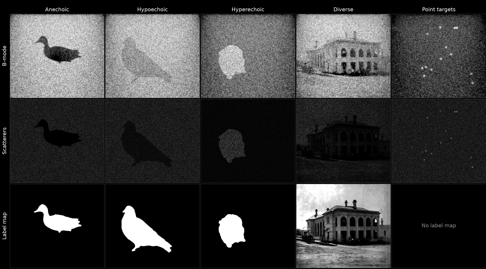

# SynthUS-FSA



*The five phantom classes (anechoic, hypoechoic, hyperechoic, diverse, point-target), one capture per column: [`image_0012`](https://huggingface.co/datasets/nvidia/OpenH-RF/blob/main/concordia/data/image_0012.hdf5), [`image_0410`](https://huggingface.co/datasets/nvidia/OpenH-RF/blob/main/concordia/data/image_0410.hdf5), [`image_0733`](https://huggingface.co/datasets/nvidia/OpenH-RF/blob/main/concordia/data/image_0733.hdf5), [`image_0753`](https://huggingface.co/datasets/nvidia/OpenH-RF/blob/main/concordia/data/image_0753.hdf5), [`image_1808`](https://huggingface.co/datasets/nvidia/OpenH-RF/blob/main/concordia/data/image_1808.hdf5). Rows show the reference B-mode (`data/image`), the simulated scatterer cloud (`data/scatterers`) and the label map (`data/segmentation` for the lesion classes, `data/diverse_source_image` for diverse; point-target captures store none).*

## Dataset Description

SynthUS-FSA is a fully synthetic corpus of pre-beamformed full-synthetic-aperture (FSA) ultrasound channel-data captures, generated with the Field II simulator to model a 128-element L11-5v linear array. Each capture fires one transmit event per element (128 transmits, receive on all 128 elements), so every element-to-element combination is retained and any receive/transmit beamforming scheme (focused B-mode, multi-angle plane-wave compounding, diverging-wave, adaptive/compressive schemes) can be retrospectively synthesized from the same channel data. The dataset is packaged in [zea](https://zea.readthedocs.io) format — the OpenH-RF reference Python library for ultrasound file I/O and beamforming — which every `.hdf5` file and `reconstruct.py` depend on. The dataset targets three OpenH-RF task categories: (1) generalized reconstruction (FSA channel data paired with a synthesized full synthetic-aperture B-mode as ground truth), (2) compressed sensing / adaptive transmit (retrospective sub-selection of the 128 transmit events — derived from the same captures, no additional files), and (3) segmentation (binary echogenicity masks on a subset of phantoms). All data is simulated — no clinical, phantom-hardware, or animal acquisition is involved.

A similar data-generation approach was used in Sharifzadeh et al. (2024). Users of this dataset are kindly requested to cite that work:

> M. Sharifzadeh, S. Goudarzi, A. Tang, H. Benali, and H. Rivaz, "Mitigating aberration-induced noise: A deep learning-based aberration-to-aberration approach," *IEEE Transactions on Medical Imaging*, vol. 43, no. 12, pp. 4380–4392, 2024.

## Dataset Contributor(s)

- Mostafa Sharifzadeh <mostafa.sharifzadeh@mail.concordia.ca> (IMPACT Lab, Concordia University)
- Hassan Rivaz <hassan.rivaz@concordia.ca> (IMPACT Lab, Concordia University)

## Dataset Creation Date

07/01/2026

## License / Terms of Use

[Creative Commons Attribution 4.0 International (CC BY 4.0)](https://creativecommons.org/licenses/by/4.0/legalcode.en). Retain attribution and identify modifications when reusing the data.

## Intended Usage

- **Generalized reconstruction** — learning a direct mapping from raw FSA channel data to a B-mode image, and/or from FSA to arbitrary retrospective beamforming targets (focused, multi-angle compounded, diverging-wave, adaptive).
- **Compressed sensing / adaptive transmit** — sparse-aperture and adaptive transmit design research using retrospective sub-selection of the 128 FSA transmit events.
- **Segmentation** — pixel-aligned echogenicity-region segmentation (anechoic / hypoechoic / hyperechoic) from raw channel data.
- **Scatterer-level analysis** — `data/scatterers` exposes the exact Field II point-scatterer cloud (position + amplitude) used to simulate each capture, for tasks that want ground truth finer than a pixel grid (e.g. quantitative ultrasound, scatterer-density estimation).

## Dataset Characterization

- **Data Collection Method:** synthetic (Field II full-synthetic-aperture simulation).
- **Labeling Method:** synthetic ground truth.
  - Segmentation masks (anechoic/hypoechoic/hyperechoic) are Open Images V7 animal-class segmentation annotations, used for shape only.
  - Diverse-echogenicity amplitude weighting uses a Wikimedia Commons photograph as a continuous grayscale weight map, preserved as `data/diverse_source_image` so an end user can see what pattern the capture was generated from.
  - The reconstruction-target B-mode (`data/image`) is synthesized from the same FSA capture (see *Data Validation* below), not an independent acquisition.
- **Acquisition system (simulated):** 128-element linear array (model: L11-5v), center frequency 5.208 MHz, element width 0.27 mm, kerf 0.03 mm, pitch 0.3 mm, element height 5 mm, elevation focus (Rfocus) 20 mm. Simulated at 104.16 MHz (a high rate required for Field II's numerical precision), then decimated ×5 to a delivered sampling rate of 20.832 MHz. Sound speed 1540 m/s. Receive dynamic-focus reconstruction uses F-number 1.75 (baked into `reconstruct.py`'s `F_NUMBER` constant — zea's own default is 1.0, so this must be supplied explicitly rather than relying on the file alone to reproduce the reference images).
- **Transmit pulse:** Hann-windowed 2.5-cycle tone burst at the 5.208 MHz center frequency, sampled at the native 104.16 MHz simulation rate. −6dB fractional bandwidth ≈ 76.5% (stored as `probe/probe_bandwidth_percent`).
- **Coordinate convention:** x = lateral, y = elevation (always 0 for this 2D acquisition), z = axial/depth — the standard zea convention, applied throughout `probe_geometry`, `transmit_origins`, and every map's `coordinates` field.
- **Frame timing:** each file is a single static frame (`n_frames=1`) with no simulated motion or pulse-repetition-frequency concept, so `scan/time_to_next_transmit` is intentionally omitted rather than populated with a fabricated value. Likewise, no time-gain-compensation was applied to this synthetic data, so `scan/tgc_gain_curve` is omitted.

## Source Attribution

The dataset as a whole is released under CC BY 4.0. Its components come from the following sources:

- **Simulated channel data, phantom parameters, and reconstruction/segmentation labels** are generated by the contributors (Field II simulation outputs) and released under CC BY 4.0.
- **Segmentation mask shapes** (anechoic/hypoechoic/hyperechoic classes, 750 captures) are sourced from [Open Images V7](https://storage.googleapis.com/openimages/web/factsfigures_v7.html)'s animal-class segmentation annotations (Google LLC). Only the binary mask is used — never the underlying source photograph. Open Images V7 licenses its annotations, including segmentation masks, under CC BY 4.0; the source photographs themselves carry a separate CC BY 2.0 license but are not used anywhere in this dataset.
- **Diverse-echogenicity amplitude-weight maps** (1,000 captures) are photographs from Wikimedia Commons, restricted to the `CC-BY-4.0` category and verified per-image against each file's `CC BY 4.0` license field before acceptance. `wikimedia_commons_metadata.csv`, at the dataset root, credits each one: a row per capture, keyed by `DatasetFile` for `image_0751.hdf5` through `image_1750.hdf5`, giving the source URL, Commons file page, author, title and license. No photograph appears in the dataset in its original form. Each was converted to grayscale, resampled to the 400 × 450 weight-map grid, histogram-equalized and rescaled to `[0, 1]`. Values above 0.9 were then set to 1 and values below 0.1 to 0, producing the weight map stored as `data/diverse_source_image`. This conversion is implemented in `wikimedia_commons_postprocess.py`.
- **Point-target phantoms** (250 captures) use no external asset — purely synthetic point scatterers.

All channel data was generated with Field II (Jensen/DTU), distributed for free academic use. Field II's terms do not restrict redistribution or licensing of simulation *output* data. Per Field II's terms, any use of this dataset should cite: J.A. Jensen, "Field: A Program for Simulating Ultrasound Systems," *Med. Biol. Eng. Comp.*, 1996; and J.A. Jensen and N.B. Svendsen, "Calculation of Pressure Fields from Arbitrarily Shaped, Apodized, and Excited Ultrasound Transducers," *IEEE Trans. Ultrason., Ferroelec., Freq. Contr.*, 1992.

## Processing the Dataset

The acquisitions can be processed with the `pipeline.yaml` definition in this folder and the [zea library](https://github.com/tue-bmd/zea).

`zea` streams the data from the Hugging Face Hub and processes it according to the pipeline. You can try it out with the following command:

```bash
zea process \
  --dataset hf://nvidia/OpenH-RF/concordia/data/image_0005.hdf5 \
  --config hf://nvidia/OpenH-RF/concordia/pipeline.yaml \
  --n-frames 1 \
  --save-as png
```

Alternatively, you can use the `reconstruct.py` [script](https://github.com/open-h/OpenH-RF/blob/main/datasets/concordia/reconstruct.py) as provided in the [OpenH-RF GitHub repository](https://github.com/open-h/OpenH-RF).

## Dataset Format

[zea v0.1.6](https://github.com/tue-bmd/zea)

The dataset is 2,000 individual zea HDF5 files (one acquisition per file) under `data/` (zea format; `zea_version` 0.1.6). Reference figures are in `examples/`; `reconstruct.py`, `pipeline.yaml`, and this card sit at the repository root. Per file:

- `data/raw_data` — full FSA channel data, `int16`, quantized from the native simulated (float32) values by per-file peak-scaling into the int16 range (~5e-5 relative quantization step — well below any physically meaningful signal feature, equivalent to how real ultrasound hardware ADCs store raw channel data).
- `data/image` — the reference B-mode: a synthetic transmit aperture (STA) reconstruction that delay-and-sums all 128 single-element FSA transmits with zea's default DAS pipeline over the intended imaging FOV (see *Subject Metadata*). This is exactly what `reconstruct.py` reproduces from `data/raw_data`.
- `data/segmentation` — boolean mask with labels `["background", <class>]`, present only for anechoic/hypoechoic/hyperechoic phantoms (750 captures) — the Open Images V7 mask directly. Not produced for diverse or point-target phantoms (no defined region to segment in either case).
- `data/echogenicity_multiplier` — present alongside `data/segmentation` (same 750 captures): the scalar amplitude multiplier Field II applied to every scatterer inside that region, e.g. "hypoechoic at 0.23×," not just "hypoechoic." A single number per file, so it's stored without a `coordinates` grid (optional per zea's `Map` spec — this isn't spatial).
- `data/diverse_source_image` — present only for diverse-class phantoms (1,000 captures): the grayscale natural-image echogenicity weight map (continuous `[0, 1]` values) each capture's scatterer amplitudes were generated from. Not a mask — just the reference image, so an end user can see what pattern produced the capture.
- `data/scatterers` — the exact Field II point-scatterer cloud used to simulate the capture (every capture, all classes): `values` = per-scatterer amplitude (a.u.), `coordinates` = per-scatterer `(x, y, z)` position in metres. ~275,000 scatterers per capture, stored via zea's custom-data extension mechanism as a `(1, n_scatterers, 1)` / `(n_scatterers, 1, 3)` pair rather than a regular pixel grid (a point cloud has no grid to speak of). This is the ground truth Field II actually simulated from — finer than any pixel-grid label derived from it.

Pre-processing applied before packaging: anti-alias FIR decimation (factor 5, 104.16 MHz → 20.832 MHz) and int16 quantization, both described above. zea's The original submission used lossless `lzf` HDF5 compression; re-saving may change storage compression without changing the RF representation.

## Dataset Quantification

**Current OpenH-RF release:** 2,000 HDF5 files; 82.39 GB (82,390,286,336 bytes) stored; root `zea_version` **0.1.6**. Sizes include all HDF5 contents and use decimal units (MB = 10^6 bytes, GB = 10^9 bytes, TB = 10^12 bytes), not decoded-array memory or original-source download sizes.

This dataset comprises 2,000 FSA captures across five echogenicity classes:

| Class | Count | File indices | Segmentation label | Other class-specific data |
|---|---|---|---|---|
| Anechoic | 250 | 0001–0250 | Yes (Open Images V7 mask) | `data/echogenicity_multiplier` (always 0) |
| Hypoechoic | 250 | 0251–0500 | Yes (Open Images V7 mask) | `data/echogenicity_multiplier` (random, 0.07–0.50) |
| Hyperechoic | 250 | 0501–0750 | Yes (Open Images V7 mask) | `data/echogenicity_multiplier` (random, 2–8) |
| Diverse (natural-image-derived) | 1,000 | 0751–1750 | No | `data/diverse_source_image` |
| Point-target | 250 | 1751–2000 | No | — |

`data/scatterers` (the raw point-scatterer cloud) is present for all 2,000 captures regardless of class.

Each capture's class label is stored in its file metadata (`metadata/annotations/label`).

- **Stored HDF5 size:** 82.39 GB total; 41.20 MB per file on average. RF remains int16 and post-decimation.
- **Train / validation / test split:** none predefined — the corpus is released as a single set for users to partition as their task requires (class membership and index ranges are given above).
- **Per-sample feature table:**

| Field | Shape | Dtype | Units | Description |
|---|---|---|---|---|
| `data/raw_data` | `(1, 128, n_ax, 128, 1)` | int16 | a.u. | FSA channel data: 1 frame, 128 transmits (one per element), `n_ax` axial samples post-decimation (depth-dependent round-trip timing means this varies slightly per capture — read `.shape` at load time rather than assuming a fixed value), 128 receive elements, 1 channel (RF) |
| `data/image/values` | `(1, 542, 384)` | float32 | dB | Synthetic-aperture (128-transmit) reference B-mode, log-compressed |
| `data/image/coordinates` | `(542, 384, 3)` | float32 | m | Per-pixel (x, y, z) for `image/values` |
| `data/segmentation/values`* | `(1, 400, 450, 2)` | bool | – | One-hot echogenicity mask (`background`, class); *anechoic/hypoechoic/hyperechoic only* |
| `data/segmentation/coordinates`* | `(400, 450, 3)` | float32 | m | Per-pixel (x, y, z) for the segmentation grid |
| `data/echogenicity_multiplier/values`* | `(1, 1, 1)` | float32 | – | Scalar amplitude multiplier applied inside the segmentation region; *anechoic/hypoechoic/hyperechoic only* |
| `data/diverse_source_image/values`* | `(1, 400, 450)` | float32 | a.u. | Grayscale echogenicity weight map, `[0, 1]`; *diverse class only* |
| `data/diverse_source_image/coordinates`* | `(400, 450, 3)` | float32 | m | Per-pixel (x, y, z) for the weight-map grid |
| `data/scatterers/values` | `(1, ~275000, 1)` | float32 | a.u. | Per-scatterer amplitude (one row per Field II scatterer, not a pixel grid) |
| `data/scatterers/coordinates` | `(~275000, 1, 3)` | float32 | m | Per-scatterer (x, y, z) position |
| `probe/probe_geometry` | `(128, 3)` | float32 | m | Element positions |
| `probe/probe_bandwidth_percent` | scalar | float32 | % | −6dB fractional bandwidth of the transmit pulse (≈76.5%) |
| `scan/t0_delays`, `scan/tx_apodizations` | `(128, 128)` | float32 | s, – | Per-transmit, per-element delay / apodization (identity apodization — one element fires per transmit) |
| `scan/azimuth_angles` | `(128,)` | float32 | rad | All zero — 2D acquisition, no azimuthal steering |

## Subject Metadata

Not applicable — no human or animal subjects. Each "subject" is a simulated phantom of ≈275,000 scatterers. The reconstructed image FOV is 45 mm (lateral) × 40 mm (axial), starting 10 mm from the transducer face. The scatterer field is deliberately larger than this FOV (≈49.5 mm wide, extending to 54 mm deep) so that beamforming at the FOV edges is fully supported by surrounding scatterers and free of edge-truncation artifacts; only the reconstruction grid is cropped to the FOV, while `data/raw_data` and `data/scatterers` retain the full extent. Per-class amplitude weighting inside the mask/weight-map region:

- **Anechoic:** scatterer amplitude zeroed.
- **Hypoechoic:** amplitude × U[0.07, 0.50]; the exact per-capture draw is preserved in `data/echogenicity_multiplier`.
- **Hyperechoic:** amplitude × U[2, 8]; same per-capture preservation via `data/echogenicity_multiplier`.
- **Diverse:** continuous grayscale weight map from a Wikimedia Commons photograph (histogram-equalized, normalized to [0, 1], clipped at the extremes) — preserved as `data/diverse_source_image`.
- **Point-target:** 10–20 point targets per phantom (count ~ U[10, 20], rounded to an integer), each target's amplitude an independent U[15, 35] draw.  The targets consist of adjacent groups of high-amplitude scatterers within `data/scatterers`.

All classes except point-target additionally include 2–5 extra bright point scatterers (amplitude 18–22) scattered at valid random positions, for realism.

## Data Validation

`reconstruct.py` (+ `pipeline.yaml`, zea's default DAS pipeline: Cast → ApplyWindow → Demodulate → Beamform → EnvelopeDetect → Normalize → LogCompress; each stage is explained in `reconstruct.py`'s own module docstring) reconstructs a synthetic transmit aperture (STA) B-mode from `data/raw_data` using all 128 transmits, over the same field of view as the stored `data/image` reference. It renders that reconstruction on physical mm axes next to the capture's class-specific label — segmentation foreground for anechoic/hypoechoic/hyperechoic, `data/diverse_source_image` for diverse, none for point-target — and the `data/scatterers` cloud coloured by |amplitude|, all on shared equal-aspect mm axes, confirming the label, reconstruction, and scatterer field are spatially registered. [`assets/reference_capture.png`](assets/reference_capture.png) is one such figure.

## Known Issues

- **`data/image` is a log-compressed dB B-mode, not raw beamformed RF** — This is a minor packaging note, not a coverage gap, precisely because the data is FSA: `data/raw_data` retains every element-to-element transmit/receive combination (128 single-element transmit firings × 128-element receive aperture on the L11-5v), which is a more general representation than any one fixed beamformed product could be: by delay-and-sum with the appropriate per-element transmit delays and apodization (linear superposition over the 128 single-element firings), it is a sufficient basis to retrospectively synthesize other transmit/receive schemes — multi-angle plane-wave compounding at arbitrary steering angles, diverging-wave imaging from an arbitrary virtual source behind the array, conventional focused/multi-line transmit — with no re-acquisition. `reconstruct.py` as shipped only implements one of these (the full 128-transmit STA beamforming used to produce `data/image`, via zea's default DAS pipeline, `pipeline.yaml`); it does not take a scheme argument. Reconstructing a different scheme means modifying `reconstruct.py` accordingly — supplying the corresponding transmit delays/apodization to zea's `Beamform` op.

## Ethical Considerations

Entirely synthetic data. No human or animal subjects are involved, and no IRB/ethics approval is required or applicable. The "animal-class" Open Images V7 segmentation annotations and Wikimedia Commons photographs referenced elsewhere in this card contribute only geometric silhouette shapes and grayscale texture patterns, respectively — no live animal or human subject, tissue, or imagery of either is used anywhere in this dataset.
