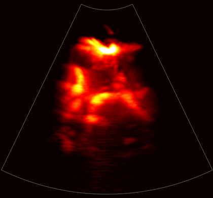
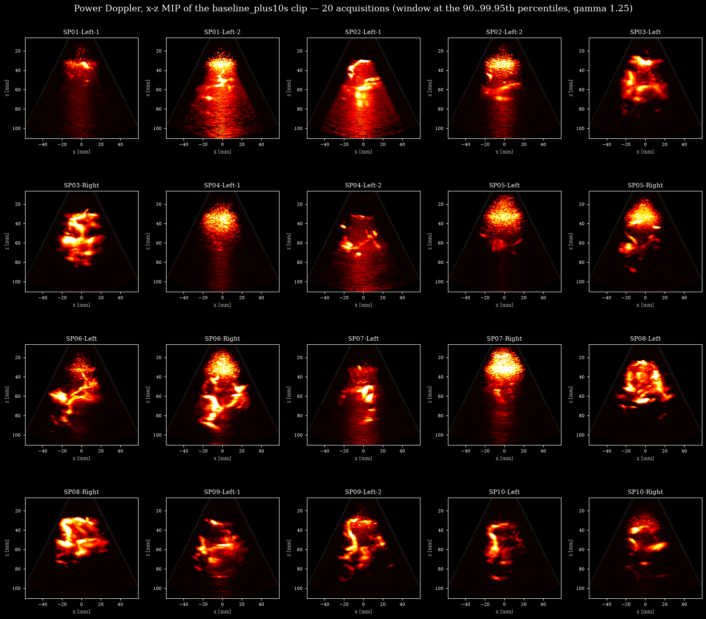
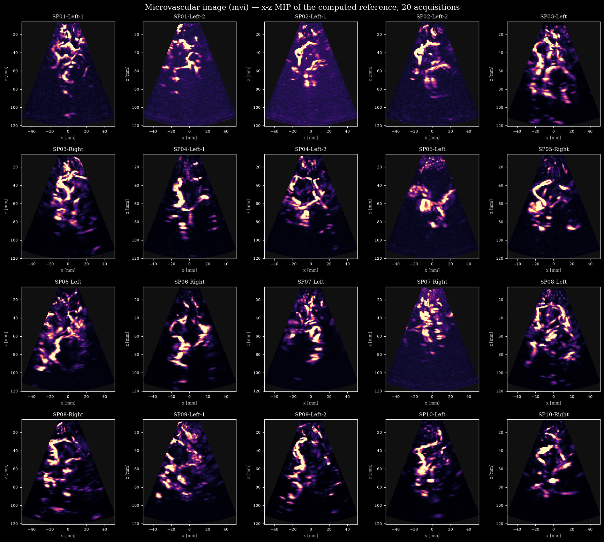
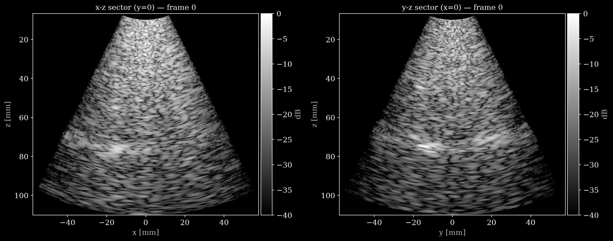
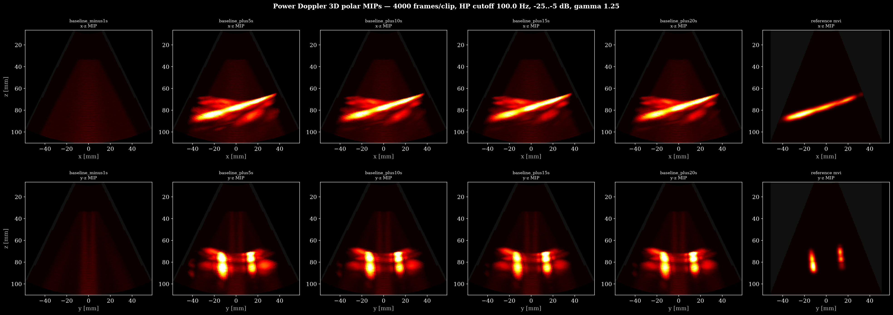
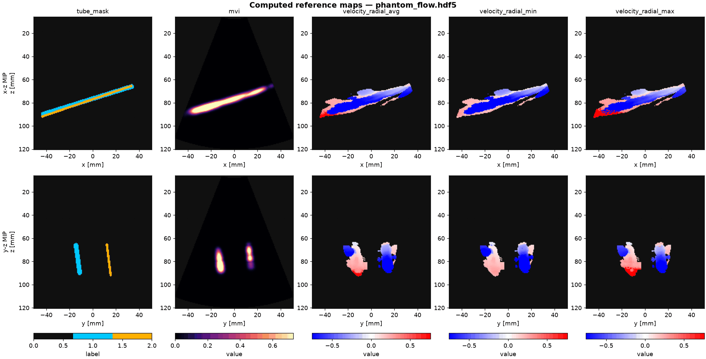
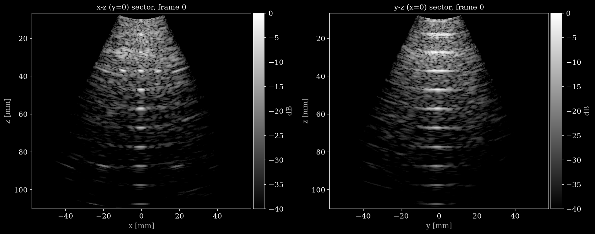
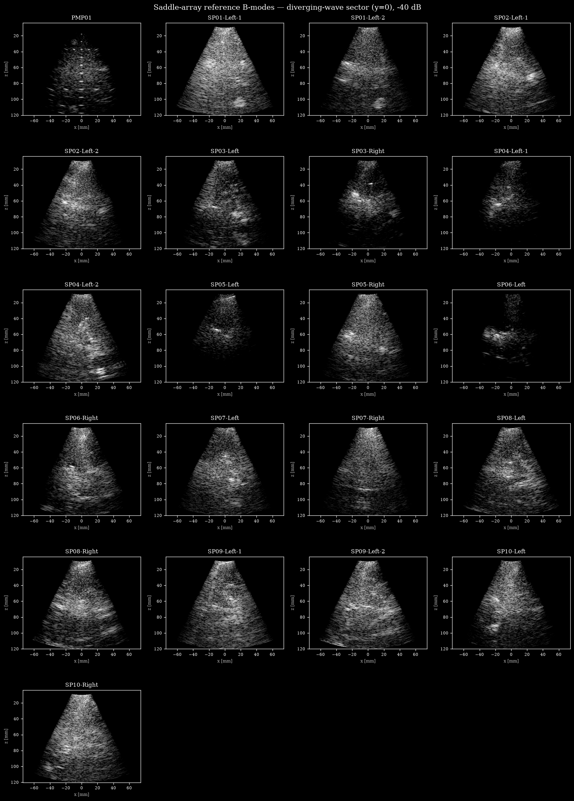

# OpenH-RF - Resolve Stroke datasets

*Figure: 3D power Doppler of the transcranial CEUS acquisition `clinical/SP03-Left` at
bolus +10 s, x-z maximum-intensity projection, reconstructed from the released channel
data.*

[Resolve Stroke](https://www.resolvestroke.com/) develops SYLVER, a
software-driven ultrasound platform that supports clinical assessment in
patients suspected of, or at risk for, cerebral perfusion abnormalities by
improving visualization of cerebral vasculature and providing complementary
information on cerebral perfusion.
SYLVER images with a 32×32 matrix array probe at 2 MHz
using diverging-wave transmits. CE and FDA clearances are expected in 2026.
This directory holds the data Resolve Stroke contributes to OpenH-RF: pre-beamformed
RF/IQ channel data from an imaging phantom, a flow phantom, and in-vivo transcranial
acquisitions, all de-identified and released under CC BY 4.0. The in-vivo data comes
from the CPP-approved SCULPT clinical study. Two transmit sequences are included: a
saddle sequence that images a 2D plane for real-time B-mode, and a 4 kHz
single-aperture volume sequence for CEUS and blood-flow measurement.

Each dataset directory holds its data card (`README.md`), a `reconstruct.py` +
`pipeline.yaml` beamforming recipe and, for the CEUS datasets, a power-Doppler
reconstruction; the HDF5 files are on the Hub and the preview images in
[`assets/`](assets/).

## OpenH-RF Release Inventory

**Current OpenH-RF release:** 43 HDF5 files; 110.62 GB (110,619,394,048 bytes) stored; root `zea_version` **0.1.6**. Sizes include all HDF5 contents and use decimal units (MB = 10^6 bytes, GB = 10^9 bytes, TB = 10^12 bytes), not decoded-array memory or original-source download sizes.

## Contents

| Path | What's inside |
|------|---------------|
| [`clinical/`](clinical/) | 20 clinical transcranial CEUS acquisitions (SCULPT study, subjects `SP01`–`SP10`, Left/Right), one HDF5 per acquisition (five 1 s bolus wash-in clips) under `clinical/<name>/`. All 20 share the same probe, sequence and layout, so one data card, the reconstruction scripts and the pipeline YAMLs live at the `clinical/` root (pick the acquisition with `SUBJECT` at the top of each script). |
| [`phantom_flow/`](phantom_flow/) | Flow-phantom CEUS (CIRS 769 + ATS523A) with microbubble contrast: five 1 s clips capturing a flow-on/flow-off bolus wash-in. Single combined HDF5 + 3D power-Doppler reconstruction. |
| [`phantom_mp/`](phantom_mp/) | Multi-tissue imaging phantom (CIRS 040GSE), pre-beamformed channel data, 1000 volumetric frames of the same static scene (wire targets, cysts, tissue-mimicking background). |
| [`saddle/`](saddle/) | Single-frame anatomical reference B-modes (21 files: the 20 clinical acquisitions + 1 imaging phantom) from the wide-angle "saddle" sequence. These are the structural companion to the clinical CEUS clips. |

## `clinical/` — transcranial CEUS, 20 acquisitions

Ten human subjects of the SCULPT study, two acquisitions each (other side and/or
second session), imaged through the temporal acoustic window during a microbubble
bolus. Each file holds 20 000 frames of diverging-wave IQ channel data at 4 kHz:
five 1 s clips taken before the bolus and at +5, +10, +15 and +20 s. Every file also
carries reference maps computed by SYLVER from the complete bolus passage
(`custom/computed_references/`: microvascular image and radial velocities on a 0.6 mm
Cartesian grid), provided as targets, not as a clinical ground truth.

Power Doppler reconstructed from the released channel data, one x-z projection per
acquisition at bolus +10 s:

The reference microvascular image of the same 20 acquisitions, x-z projection:

The [data card](clinical/README.md) has the inventory of the 20 acquisitions with the
five-clip power Doppler and the reference maps of each, the field table, and the
reconstruction scripts.

## `phantom_flow/` — flow phantom CEUS

A CIRS 769 flow phantom with an ATS523A pump, microbubbles flowing through two tubes
(4 mm and 2 mm), same sequence and clip structure as the clinical files. The file also
carries the tube mask (known geometry, an actual ground truth) and the same computed
reference maps as the clinical data.

*Figure: B-mode of one frame, x-z and y-z sectors.*

*Figure: power Doppler of the five clips, with the reference `mvi` in the last column.*

*Figure: computed reference maps (tube mask, `mvi`, radial velocities).*

See the [data card](phantom_flow/README.md).

## `phantom_mp/` — multi-tissue imaging phantom

A CIRS 040GSE phantom, 1000 volumetric frames of the same static scene with the
4 kHz diverging-wave sequence: wire targets, cysts and tissue-mimicking background,
for beamforming and resolution studies.

*Figure: B-mode of one frame, x-z and y-z sectors.*

See the [data card](phantom_mp/README.md).

## `saddle/` — anatomical reference B-modes

One wide-angle diverging-wave frame per acquisition from the "saddle" sequence
(9 transmits steered −24° to +24°; each transmit is repeated for four consecutive
256-element receive sub-apertures, so the frame carries the full 1024-element
aperture), for the 20 clinical acquisitions and the imaging phantom: the anatomical
view at the same probe placement as the CEUS clips.

*Figure: the 21 saddle B-modes.*

See the [data card](saddle/README.md).

## Contributors

Aitana Waelbroeck\*, Carl Ferlay\*, Arthur Chavignon\*, Maxence Reberol\*, Vincent Hingot\*

_\*Resolve Stroke, 29 Rue du Faubourg Saint-Jacques, 75014 Paris_
