# OpenH-RF - Resolve Stroke Clinical Transcranial CEUS (SCULPT, 20 acquisitions)


## Dataset Description

Contrast-enhanced ultrasound (CEUS) transcranial brain acquisitions of 10 human
subjects (20 acquisitions), acquired with SYLVER, Resolve Stroke's ultrasound device,
using a 32×32 matrix probe with diverging-wave transmits at 4 kHz frame rate. Each
acquisition captures a microbubble contrast-agent bolus wash-in: microbubbles are
injected, perfuse the brain vasculature through the temporal acoustic window, and
gradually wash out.

For each acquisition, five 1-second clips (4000 frames each, 20000 total) are
extracted at intervals relative to the end-of-baseline marker:

| Clip | Time offset | Description |
|------|-------------|-------------|
| `baseline_minus1s` | baseline − 1 s | Before microbubble arrival |
| `baseline_plus5s` | baseline + 5 s | Early wash-in |
| `baseline_plus10s` | baseline + 10 s | Mid wash-in |
| `baseline_plus15s` | baseline + 15 s | Late wash-in |
| `baseline_plus20s` | baseline + 20 s | Plateau / early wash-out |

The anatomical companion of every acquisition, a single wide-angle B-mode frame taken
at the same probe placement, is in the sibling [`saddle/`](../saddle/) dataset under
the same name.

## Dataset Contributor(s)

Aitana Waelbroeck\*, Carl Ferlay\*, Arthur Chavignon\*, Maxence Reberol\*, Vincent Hingot\*

\* Resolve Stroke (29 Rue du Faubourg Saint-Jacques, 75014 Paris)

Contact email: maxence.reberol@resolvestroke.com

## Dataset Creation Date

07/09/2026

## License / Terms of Use

CC BY 4.0. Data is released under Creative Commons Attribution 4.0 International,
which permits commercial use with attribution. (The Python scripts in this directory
carry their own `SPDX-License-Identifier: Apache-2.0` header; the dataset itself is
CC BY 4.0.)

## Intended Usage

Contrast-enhanced ultrasound flow/perfusion quantification, microbubble detection
and tracking, power-Doppler and CEUS transcranial imaging, and matrix-probe
diverging-wave beamforming research (RFP task group 6.2, Blood Flow).

## Dataset Characterization

- Data collection method: 10 human subjects, 20 acquisitions (2 per subject: the
  other side and/or a second session), transcranial CEUS with microbubble contrast
  agent (bolus injection), acquired through the temporal acoustic window.
- Labeling method: Automatic, no manual annotation. Per-frame clip labels
  (`metadata/annotations/label`, one of the five clip names above) are assigned from
  the acquisition time relative to the end-of-baseline marker. Per-voxel reference maps
  (`mvi`, radial velocities) are generated by SYLVER's processing pipeline from the
  complete bolus passage (see [Computed References](#computed-references)).
- Acquisition system: SYLVER (Resolve Stroke's ultrasound device). 32×32 matrix
  probe, 0.50 mm pitch, 0.30 mm kerf; transmit center frequency ≈ 2.031 MHz, sound
  speed 1540 m/s. Diverging-wave transmits; receive sub-apertures flattened into 256
  virtual elements. Channel data is DDC (baseband) IQ, so `sampling_frequency`
  (≈ 2.031 MHz) is the post-decimation IQ rate and equals `demodulation_frequency`.

## Dataset Format

One zea HDF5 file per acquisition, `<name>/<name>.hdf5`, containing all 5 clips
concatenated. Files are named `<subject>-<side>[-<session>]` (anonymized subject
code `SP01`–`SP10`, imaging side, and a sequential index when a subject has two
acquisitions on the same side). Gaps between clips are encoded in
`scan/time_to_next_transmit`. Per-frame clip labels are stored in
`metadata/annotations/label`.

Computed reference maps (derived from the SYLVER processed exam) are stored in the
zea `custom` group under `custom/computed_references/`: `mvi`,
`velocity_radial_avg` / `_min` / `_max`, and a shared `coordinates` array (per-voxel
`[x, y, z]` in metres), all on one 0.6 mm Cartesian grid `(192, 171, 171)`. Read
them via `zea.File(...).dataset("custom/computed_references/<name>")`.

The files are in the zea HDF5 format, root `zea_version` 0.1.6. `data/raw_data` is DDC IQ (last axis [I, Q]). The hardware time-gain compensation is baked into `raw_data`;
`scan/tgc_gain_curve` is the applied (non-linear) gain per axial sample; divide by
it to recover true channel amplitudes. The reconstruction scripts divide `raw_data`
by this curve before beamforming (the `zea.Pipeline` itself stays standard; the
reversal is a plain array step).

## Dataset Quantification

**Current OpenH-RF release:** 20 HDF5 files; 105.16 GB (105,159,196,672 bytes) stored; root `zea_version` **0.1.6**. Sizes include all HDF5 contents and use decimal units (MB = 10^6 bytes, GB = 10^9 bytes, TB = 10^12 bytes), not decoded-array memory or original-source download sizes.

- Acquisitions: 20 (10 subjects × 2)
- Frames per acquisition: 20000 (5 clips × 4000 frames)
- Frame rate: 4000 Hz (within each clip)
- Clip duration: 1 s each
- **Stored HDF5 size:** ≈ 5.26 GB per acquisition, 105.16 GB in total.

| Field | Shape | dtype | Units | Description |
|---|---|---|---|---|
| `data/raw_data` | `(20000, 1, 320, 256, 2)` | int16 | n/a | IQ channel data: frames × tx × axial × elements × {I, Q} |
| `probe/probe_geometry` | `(256, 3)` | float32 | m | Virtual element positions |
| `scan/t0_delays` | `(1, 256)` | float32 | s | Per-element transmit delays |
| `scan/tx_apodizations` | `(1, 256)` | float32 | n/a | Per-element transmit weights |
| `scan/focus_distances` | `(1,)` | float32 | m | Virtual-source distance (diverging wave, negative) |
| `scan/polar_angles` | `(1,)` | float32 | rad | Transmit steering (0) |
| `scan/azimuth_angles` | `(1,)` | float32 | rad | Transmit steering (0) |
| `scan/transmit_origins` | `(1, 3)` | float32 | m | Transmit origin |
| `scan/initial_times` | `(1,)` | float32 | s | ADC start time |
| `scan/time_to_next_transmit` | `(20000, 1)` | float32 | s | Inter-frame timing (encodes clip gaps: 5, 4, 4, 4 s) |
| `scan/tgc_gain_curve` | `(320,)` | float32 | n/a | Hardware TGC applied to `raw_data`; divide by it to undo (`reconstruct*.py` does this before beamforming) |
| `scan/sampling_frequency` | scalar | float32 | Hz | 2031250 (post-DDC IQ rate) |
| `scan/center_frequency` | scalar | float32 | Hz | 2031250 |
| `scan/demodulation_frequency` | scalar | float32 | Hz | 2031250 |
| `scan/sound_speed` | scalar | float32 | m/s | 1540 |

### Inventory

One row per acquisition. Power Doppler: x-z maximum-intensity projection of each of
the five clips (baseline, +5, +10, +15, +20 s), display window set per acquisition
from the 90th and 99.95th percentiles of its dB values. Reference maps: `mvi`
(microvascular image) and `velocity_radial_avg`, each as x-z and y-z projections.

<table width="100%">
  <tr>
    <th>Acquisition</th><th>Subject</th><th>Side</th><th>Power Doppler, five clips (x-z MIP)</th><th>Reference maps (mvi · velocity_radial_avg, x-z and y-z)</th>
  </tr>
  <tr><td><a href="https://huggingface.co/datasets/nvidia/OpenH-RF/tree/main/resolvestroke/clinical/SP01-Left-1"><code>SP01-Left-1</code></a></td><td>SP01</td><td>Left</td><td><a href="../assets/clinical/SP01-Left-1_pd_clips.png">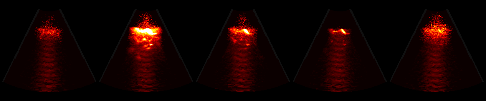</a></td><td><a href="../assets/clinical/SP01-Left-1_references.png">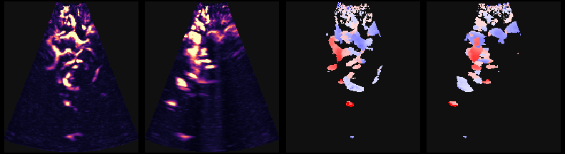</a></td></tr>
  <tr><td><a href="https://huggingface.co/datasets/nvidia/OpenH-RF/tree/main/resolvestroke/clinical/SP01-Left-2"><code>SP01-Left-2</code></a></td><td>SP01</td><td>Left</td><td><a href="../assets/clinical/SP01-Left-2_pd_clips.png">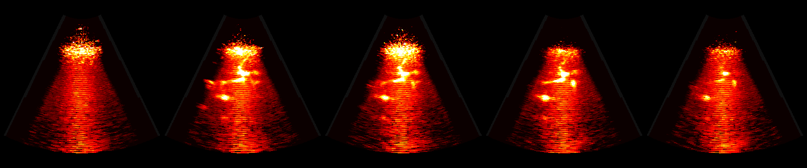</a></td><td><a href="../assets/clinical/SP01-Left-2_references.png">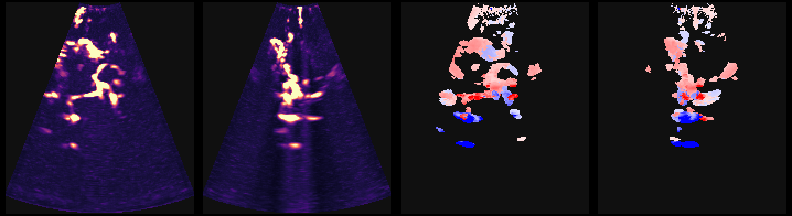</a></td></tr>
  <tr><td><a href="https://huggingface.co/datasets/nvidia/OpenH-RF/tree/main/resolvestroke/clinical/SP02-Left-1"><code>SP02-Left-1</code></a></td><td>SP02</td><td>Left</td><td><a href="../assets/clinical/SP02-Left-1_pd_clips.png">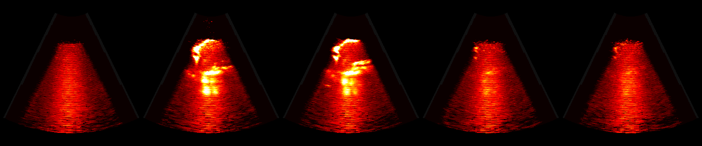</a></td><td><a href="../assets/clinical/SP02-Left-1_references.png">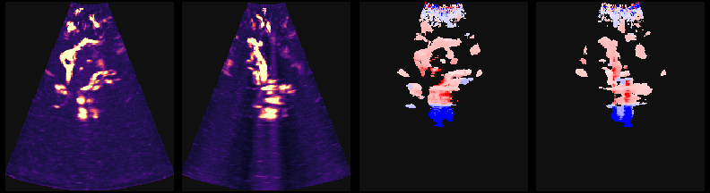</a></td></tr>
  <tr><td><a href="https://huggingface.co/datasets/nvidia/OpenH-RF/tree/main/resolvestroke/clinical/SP02-Left-2"><code>SP02-Left-2</code></a></td><td>SP02</td><td>Left</td><td><a href="../assets/clinical/SP02-Left-2_pd_clips.png">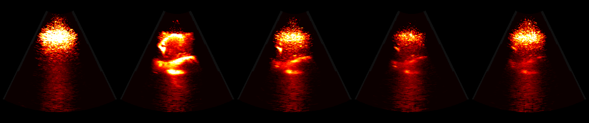</a></td><td><a href="../assets/clinical/SP02-Left-2_references.png">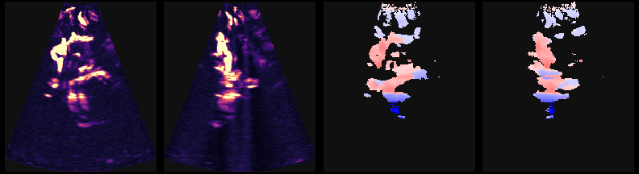</a></td></tr>
  <tr><td><a href="https://huggingface.co/datasets/nvidia/OpenH-RF/tree/main/resolvestroke/clinical/SP03-Left"><code>SP03-Left</code></a></td><td>SP03</td><td>Left</td><td><a href="../assets/clinical/SP03-Left_pd_clips.png">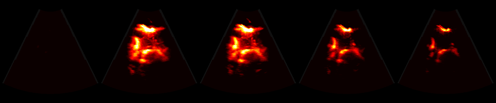</a></td><td><a href="../assets/clinical/SP03-Left_references.png">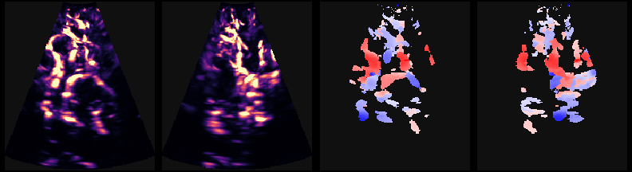</a></td></tr>
  <tr><td><a href="https://huggingface.co/datasets/nvidia/OpenH-RF/tree/main/resolvestroke/clinical/SP03-Right"><code>SP03-Right</code></a></td><td>SP03</td><td>Right</td><td><a href="../assets/clinical/SP03-Right_pd_clips.png">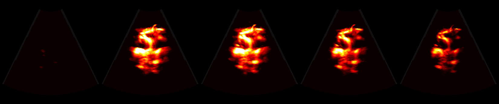</a></td><td><a href="../assets/clinical/SP03-Right_references.png">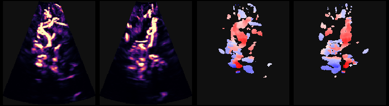</a></td></tr>
  <tr><td><a href="https://huggingface.co/datasets/nvidia/OpenH-RF/tree/main/resolvestroke/clinical/SP04-Left-1"><code>SP04-Left-1</code></a></td><td>SP04</td><td>Left</td><td><a href="../assets/clinical/SP04-Left-1_pd_clips.png">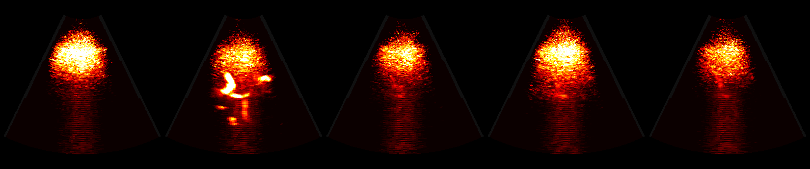</a></td><td><a href="../assets/clinical/SP04-Left-1_references.png">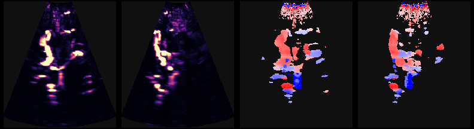</a></td></tr>
  <tr><td><a href="https://huggingface.co/datasets/nvidia/OpenH-RF/tree/main/resolvestroke/clinical/SP04-Left-2"><code>SP04-Left-2</code></a></td><td>SP04</td><td>Left</td><td><a href="../assets/clinical/SP04-Left-2_pd_clips.png">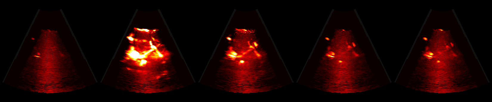</a></td><td><a href="../assets/clinical/SP04-Left-2_references.png">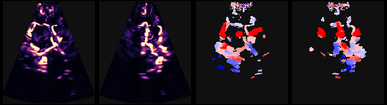</a></td></tr>
  <tr><td><a href="https://huggingface.co/datasets/nvidia/OpenH-RF/tree/main/resolvestroke/clinical/SP05-Left"><code>SP05-Left</code></a></td><td>SP05</td><td>Left</td><td><a href="../assets/clinical/SP05-Left_pd_clips.png">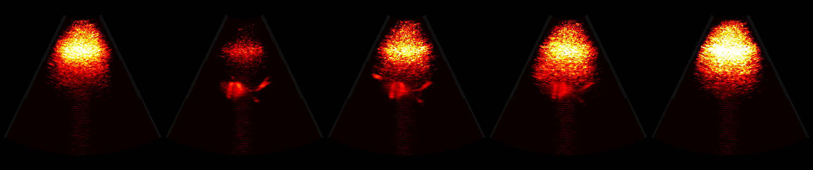</a></td><td><a href="../assets/clinical/SP05-Left_references.png">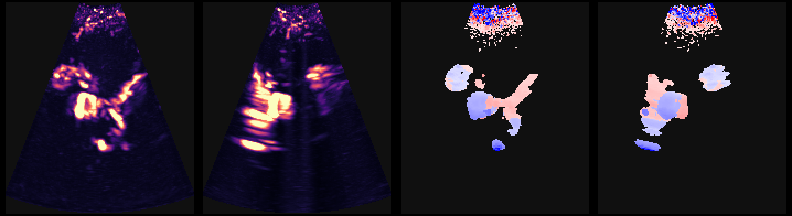</a></td></tr>
  <tr><td><a href="https://huggingface.co/datasets/nvidia/OpenH-RF/tree/main/resolvestroke/clinical/SP05-Right"><code>SP05-Right</code></a></td><td>SP05</td><td>Right</td><td><a href="../assets/clinical/SP05-Right_pd_clips.png">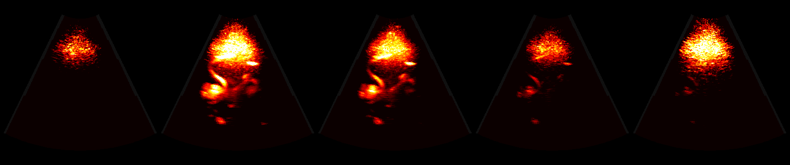</a></td><td><a href="../assets/clinical/SP05-Right_references.png">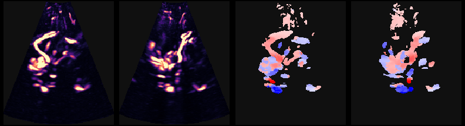</a></td></tr>
  <tr><td><a href="https://huggingface.co/datasets/nvidia/OpenH-RF/tree/main/resolvestroke/clinical/SP06-Left"><code>SP06-Left</code></a></td><td>SP06</td><td>Left</td><td><a href="../assets/clinical/SP06-Left_pd_clips.png">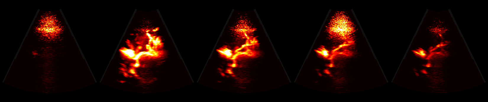</a></td><td><a href="../assets/clinical/SP06-Left_references.png">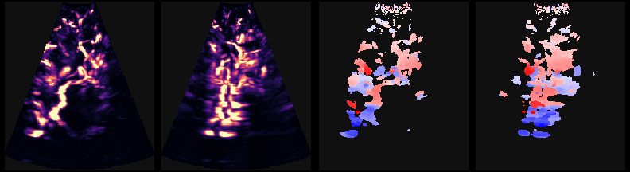</a></td></tr>
  <tr><td><a href="https://huggingface.co/datasets/nvidia/OpenH-RF/tree/main/resolvestroke/clinical/SP06-Right"><code>SP06-Right</code></a></td><td>SP06</td><td>Right</td><td><a href="../assets/clinical/SP06-Right_pd_clips.png">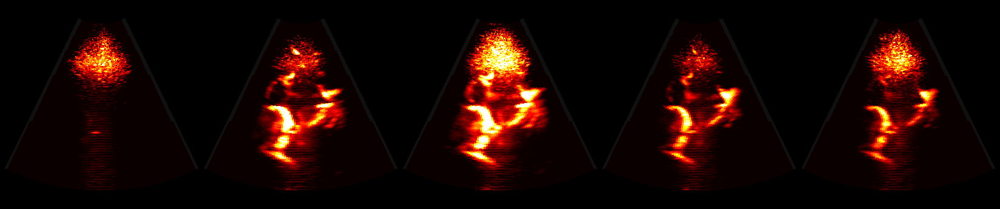</a></td><td><a href="../assets/clinical/SP06-Right_references.png">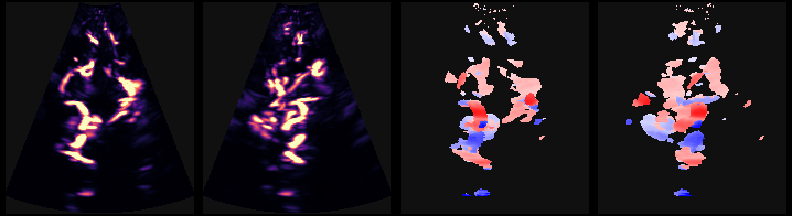</a></td></tr>
  <tr><td><a href="https://huggingface.co/datasets/nvidia/OpenH-RF/tree/main/resolvestroke/clinical/SP07-Left"><code>SP07-Left</code></a></td><td>SP07</td><td>Left</td><td><a href="../assets/clinical/SP07-Left_pd_clips.png">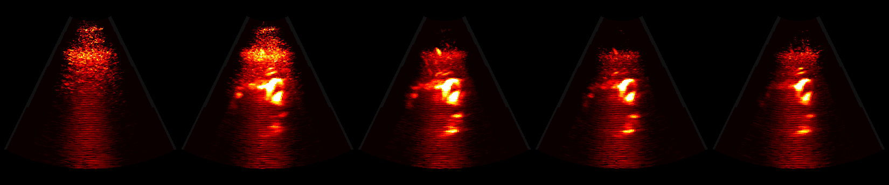</a></td><td><a href="../assets/clinical/SP07-Left_references.png">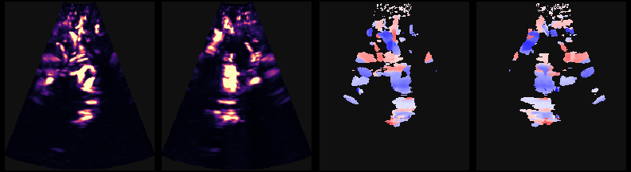</a></td></tr>
  <tr><td><a href="https://huggingface.co/datasets/nvidia/OpenH-RF/tree/main/resolvestroke/clinical/SP07-Right"><code>SP07-Right</code></a></td><td>SP07</td><td>Right</td><td><a href="../assets/clinical/SP07-Right_pd_clips.png">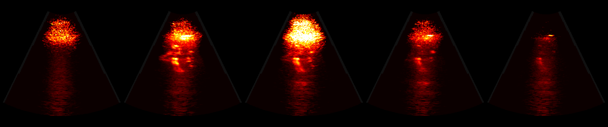</a></td><td><a href="../assets/clinical/SP07-Right_references.png">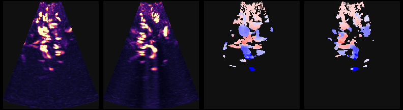</a></td></tr>
  <tr><td><a href="https://huggingface.co/datasets/nvidia/OpenH-RF/tree/main/resolvestroke/clinical/SP08-Left"><code>SP08-Left</code></a></td><td>SP08</td><td>Left</td><td><a href="../assets/clinical/SP08-Left_pd_clips.png">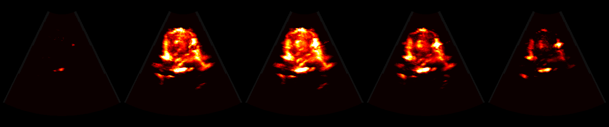</a></td><td><a href="../assets/clinical/SP08-Left_references.png">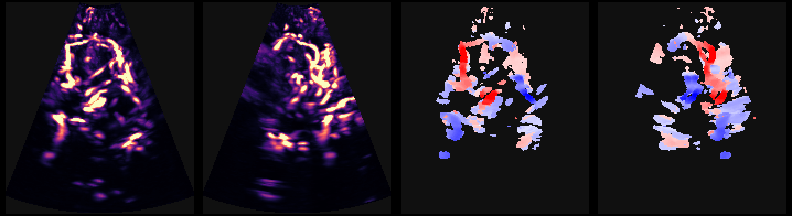</a></td></tr>
  <tr><td><a href="https://huggingface.co/datasets/nvidia/OpenH-RF/tree/main/resolvestroke/clinical/SP08-Right"><code>SP08-Right</code></a></td><td>SP08</td><td>Right</td><td><a href="../assets/clinical/SP08-Right_pd_clips.png">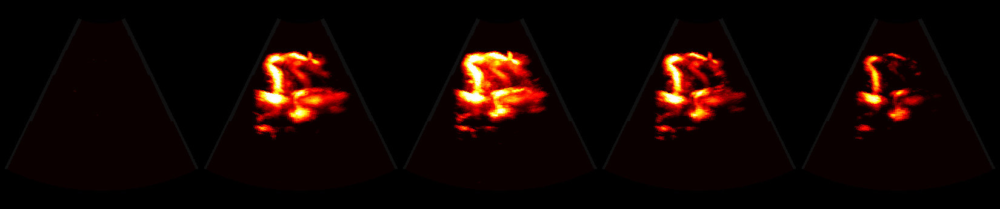</a></td><td><a href="../assets/clinical/SP08-Right_references.png">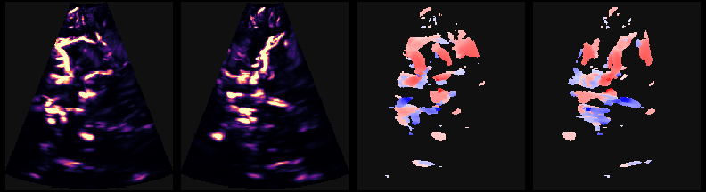</a></td></tr>
  <tr><td><a href="https://huggingface.co/datasets/nvidia/OpenH-RF/tree/main/resolvestroke/clinical/SP09-Left-1"><code>SP09-Left-1</code></a></td><td>SP09</td><td>Left</td><td><a href="../assets/clinical/SP09-Left-1_pd_clips.png">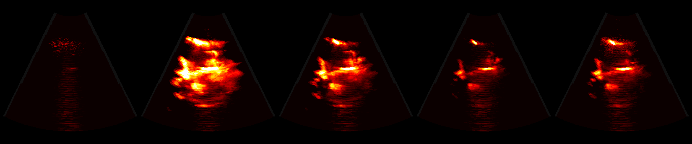</a></td><td><a href="../assets/clinical/SP09-Left-1_references.png">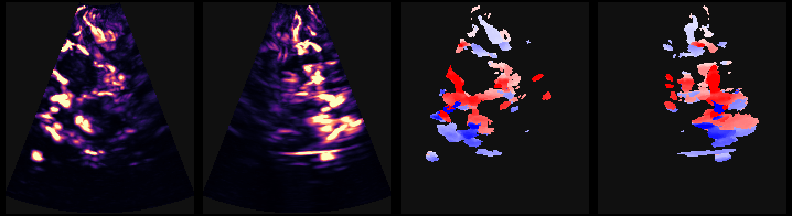</a></td></tr>
  <tr><td><a href="https://huggingface.co/datasets/nvidia/OpenH-RF/tree/main/resolvestroke/clinical/SP09-Left-2"><code>SP09-Left-2</code></a></td><td>SP09</td><td>Left</td><td><a href="../assets/clinical/SP09-Left-2_pd_clips.png">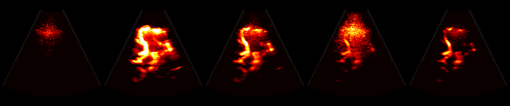</a></td><td><a href="../assets/clinical/SP09-Left-2_references.png">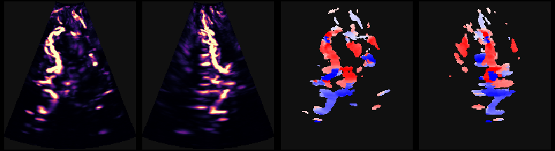</a></td></tr>
  <tr><td><a href="https://huggingface.co/datasets/nvidia/OpenH-RF/tree/main/resolvestroke/clinical/SP10-Left"><code>SP10-Left</code></a></td><td>SP10</td><td>Left</td><td><a href="../assets/clinical/SP10-Left_pd_clips.png">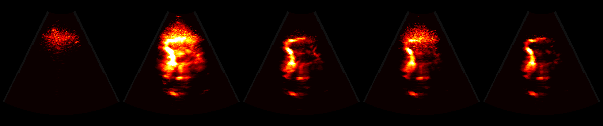</a></td><td><a href="../assets/clinical/SP10-Left_references.png">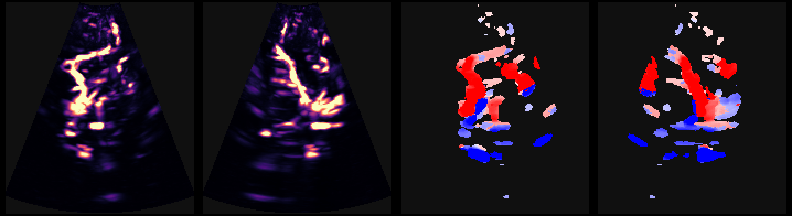</a></td></tr>
  <tr><td><a href="https://huggingface.co/datasets/nvidia/OpenH-RF/tree/main/resolvestroke/clinical/SP10-Right"><code>SP10-Right</code></a></td><td>SP10</td><td>Right</td><td><a href="../assets/clinical/SP10-Right_pd_clips.png">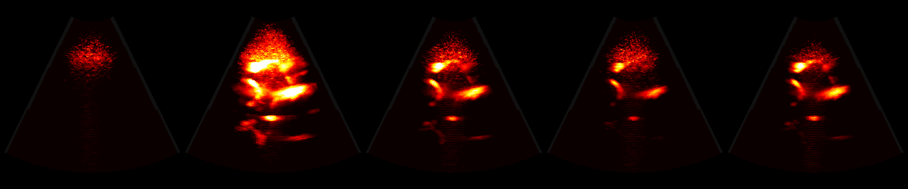</a></td><td><a href="../assets/clinical/SP10-Right_references.png">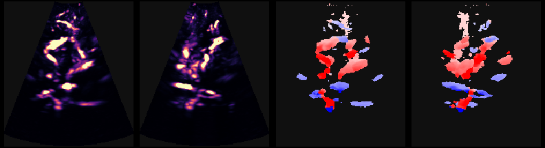</a></td></tr>
</table>

## Subject Metadata

- Type: Human subjects (`metadata/subject/type` = `human`)
- Subject IDs: `SP01`–`SP10` (anonymized, `metadata/subject/id`); each subject
  contributes 2 acquisitions (see the inventory above for side and session)
- Anatomy: Brain (transcranial), left or right temporal acoustic window
- Contrast agent: Microbubbles (bolus injection)

## Data Validation

The reconstruction recipe is identical for all 20 acquisitions, so the scripts and
pipeline YAMLs live once in this directory. Each script has a `SUBJECT` constant at
the top (default `"SP02-Left-2"`); set it to any acquisition name from the inventory,
e.g. `SUBJECT = "SP07-Right"`, and the `hf://` input path
`hf://nvidia/OpenH-RF/resolvestroke/clinical/<SUBJECT>/<SUBJECT>.hdf5` and the output
filenames follow from it. Swap `INPUT` for a local path to run against your own copy.

`reconstruct.py` first divides `raw_data` by `scan/tgc_gain_curve` (reverse TGC),
then runs a standard `zea.Pipeline` (cast → DAS beamform → envelope → normalize →
log-compress) defined in `pipeline.yaml` to reconstruct a B-mode from the IQ channel
data. Because the probe is a 2D matrix array insonified by a single diverging-wave
transmit, `reconstruct.py` beamforms on polar (sector) grids and renders two
perpendicular sector B-modes, the x-z plane (y = 0) and the y-z plane (x = 0), side
by side:

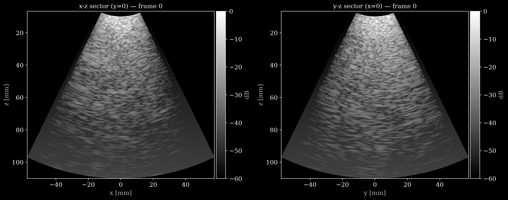

There is little to see in a single-frame B-mode of a transcranial CEUS acquisition:
through the skull the diverging-wave frame is dominated by speckle and reverberation,
and the microbubbles are not distinguishable from tissue without temporal filtering.
The B-mode only checks the geometry and depth scaling of the reconstruction; the
content of the data appears in the power-Doppler reconstruction below.

A display-only linear TGC (1.5 dB/cm) adds a depth-dependent dB gain to the rendered
image, compensating the attenuation that `reverse_tgc` leaves uncompensated so deeper
structure stays visible. It does not modify the stored data.

```bash
uv run --project /path/to/OpenH-RF python reconstruct.py
```

### Power-Doppler reconstruction (derived product)

`reconstruct_PD_3d.py` (config `pipeline_PD_3d.yaml`) demonstrates a flow/contrast
view. For each clip it beamforms all 4000 frames, in blocks of 250, onto a real 3D
polar sector volume (radius × azimuth × elevation), applies a 100 Hz slow-time
high-pass (wall) filter to suppress stationary tissue, and integrates power Doppler
(sum of the squared envelope over the frames), then displays x-z and y-z
maximum-intensity projections (MIPs) for all five clips in dB relative to the maximum
over the clips (-25 to -5 dB, gamma 1.25, `hot` colormap), with the reference `mvi`
map of the same file in the last column for comparison. The wall filter and
power-Doppler integration are custom `zea` pipeline ops registered in the script
(`tissue_highpass`, `power_doppler`). The hardware TGC stored in `raw_data` is kept.

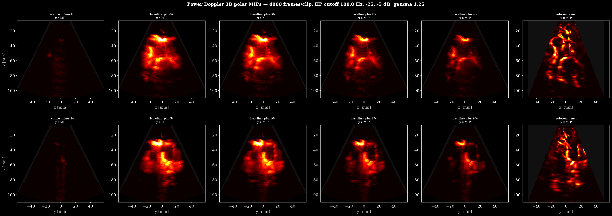

Run (a GPU is strongly recommended: about 14 min per acquisition with `uv sync --extra gpu`,
hours with the CPU-only JAX of the plain `uv sync`):

```bash
uv run --project /path/to/OpenH-RF python reconstruct_PD_3d.py
```

## Computed References

Reference maps derived from the SYLVER processed exam of each acquisition, stored
in `custom/computed_references/` (read via
`zea.File(...).dataset("custom/computed_references/<name>")`). All share one
0.6 mm Cartesian grid `(192, 171, 171)`; the `coordinates` array gives each voxel's
`[x, y, z]` in metres.

The reference maps were computed by SYLVER's proprietary processing pipeline from
the complete bolus passage, not from the five 1 s clips released here. They are
therefore not reproducible from the released frames, and are provided as reference
targets, for instance for learning-based reconstruction, microbubble-flow or perfusion
estimation from the channel data. They are a device output, not a clinically validated
ground truth.

| Field | dtype | Unit | Description |
|---|---|---|---|
| `mvi` | float32 | a.u. | Microvascular image (enhanced, time-integrated over the bolus). NaN outside the sonified cone. |
| `velocity_radial_avg` | float32 | m/s | Mean radial (along-beam) flow velocity; NaN where no flow. |
| `velocity_radial_min` | float32 | m/s | Minimum radial flow velocity; NaN where no flow. |
| `velocity_radial_max` | float32 | m/s | Maximum radial flow velocity; NaN where no flow. |
| `coordinates` | float32 | m | Per-voxel `[x, y, z]` for all maps. |

Notes:

- Velocities are radial (Doppler, along-beam) components. True flow speed depends on
  the (subject- and vessel-dependent) insonation angle, which is not known a priori
  for in-vivo cerebral vasculature.
- `mvi` and the velocity maps are NaN outside the sonified cone.

`display_references.py` renders all reference maps of one acquisition to a montage.
It reads `custom/computed_references/` (no
beamforming) and, for each map, shows two orthogonal maximum-intensity projections
(x-z on top, y-z below) on the true Cartesian geometry: `mvi` in magma and the
velocities in a symmetric blue-white-red map (±0.76 m/s). It takes `SUBJECT` or
`--input <hf:// or local path>`:

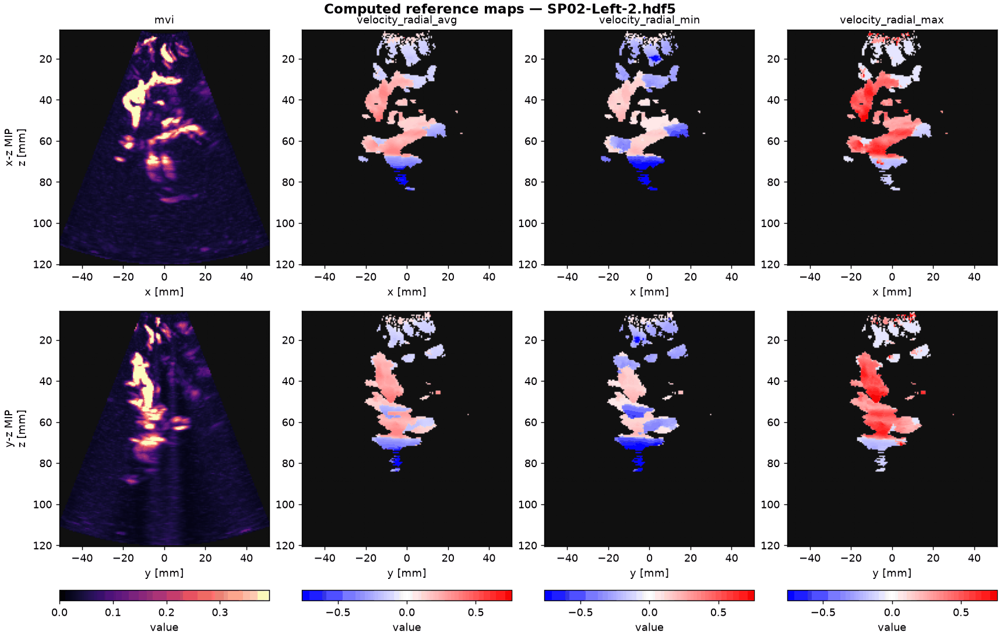

```bash
uv run --project /path/to/OpenH-RF python display_references.py
```

## Ethical Considerations

Human-subject data. Channel data was acquired during the SCULPT clinical study
(National registration number (ID RCB): 2025-A00023-46; NCT07324421), a prospective
monocentric trial conducted at CHU Gui de Chauliac (Montpellier, France) under approval
from the French ethics committee (Comité de Protection des Personnes, CPP), comparing
cerebral perfusion from Resolve Stroke's SYLVER ultrasound system with routine perfusion
CT in ICU/CCU patients, using SonoVue® as the contrast agent.

The dataset contains no direct personal identifiers: subjects are referenced only by
an anonymized study code, and no name, date of birth, or device/operator identifiers
are stored in the released files.

## Known Issues

- `raw_data` has the hardware TGC baked in; `scan/tgc_gain_curve` is that (non-linear)
  applied curve. The reconstruction scripts divide by the curve before beamforming;
  a downstream user reconstructing directly must divide by the curve too.
- `sampling_frequency ≈ center_frequency` because the data is DDC baseband IQ (see
  Dataset Characterization), not an RF acquisition.
- Radial velocity maps are along-beam only; absolute speed requires the unknown
  local vessel directions.
