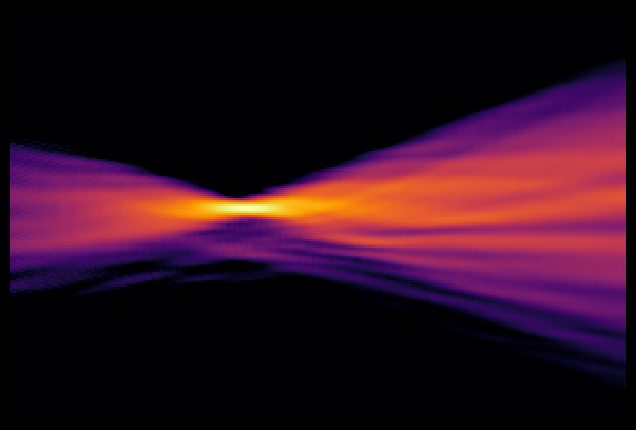
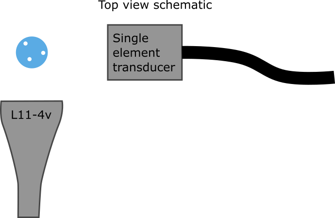

# Twente Passive Cavitation Detection of Flowing Microbubbles



*Passive acoustic map of microbubbles cavitating in the flow channel, reconstructed from the raw channel data with one-way passive minimum-variance beamforming.*

## Dataset Description
The collected data is for cavitation mapping of microbubbles, insonified with focused ultrasound at various pressures and flowrates. This data is applicable to therapeutic ultrasound and local drug delivery in any part of the human body. The used sensor hardware is a Verasonics research system with an L11-4v transducer for recording the bubble response during the treatment. Insonification is done using a single element transducer at 2.25MHz. The insonification is done with a 1000 cycles long pulse at 2.25MHz, where the first and last 2 microseconds are used for ramping up and down the pressure. The pulse repetition frequency used is 20Hz, repeated 400 times. The tube goes through the imaging plane of the L11-4v, and the transmitting single element transducer insonifies the tube from the side at 90 degrees. Both transducers are positioned to have their (elevation) focus aligned with the tube containing the microbubbles.



*Top view of the setup: the flow tube crosses the L11-4v imaging plane and the 2.25 MHz single-element transducer insonifies it from the side at 90 degrees.*

## Dataset Contributor(s)

- Hermen de Roo
- Michel Versluis
- Guillaume Lajoinie <g.p.r.lajoinie@utwente.nl> (contact)

## Dataset Creation Date
Data recorded on 01/19/2026. Dataset created on 07/09/2026.

## License / Terms of Use

[Creative Commons Attribution 4.0 International (CC BY 4.0)](https://creativecommons.org/licenses/by/4.0/legalcode.en). Retain attribution and identify modifications when reusing the data.

## Intended Usage
The dataset contains data over a large pressure range, from very low pressures up to the very high pressures used in therapeutic ultrasound. With this data one can quantify the treatment threshold and treatment effects over this wide range. The dataset also includes data for different levels of perfusion by varying the flowrate, from which the effect of perfusion on treatment efficacy can be studied. The data is intended to be processed with passive cavitation detection algorithms.

## Dataset Characterization
- **Data Collection Method:** phantom
- **Labeling Method:** N/A
- **Acquisition system:** Verasonics Vantage 256, L11-4v transducer. 128 elements, 7.24MHz center frequency, 27.778 MHz sampling rate

## Processing the Dataset

The acquisitions can be processed with the `reconstruct.py` [script](https://github.com/open-h/OpenH-RF/blob/main/datasets/twente-cavitation/reconstruct.py) as provided in the [OpenH-RF GitHub repository](https://github.com/open-h/OpenH-RF), together with the `pipeline.yaml` definition in this folder and the [zea library](https://github.com/tue-bmd/zea). The script streams the data from the Hugging Face Hub.

Set `ZEA_FILE` at the top of the script to pick an acquisition and `N_FRAMES` to set how many frames are averaged; the map is written to `assets/<file>.png`.

## Dataset Format

[zea v0.1.6](https://github.com/tue-bmd/zea)

[zea file format](https://zea.readthedocs.io/en/latest/data-acquisition.html). No preprocessing is applied.

## Dataset Quantification

**Current OpenH-RF release:** 19 HDF5 files; 10.85 GB (10,850,533,376 bytes) stored; root `zea_version` **0.1.6**. Sizes include all HDF5 contents and use decimal units (MB = 10^6 bytes, GB = 10^9 bytes, TB = 10^12 bytes), not decoded-array memory or original-source download sizes.

- 19 aquisitions of 400 frames each, totalling 7600 frames
- No train/validation/test split is defined; all acquisitions are provided in full.
- **Stored HDF5 size:** 10.85 GB (10,850,533,376 bytes).
- All recordings were taken under identical conditions, except for the driving pressure and flowrate of the microbubble solution through the channel.

Each acquisition is one zea HDF5 file with a single track (`tracks/track_0`). The per-frame channel data plus the scan/probe fields needed to reconstruct it are:

| Field | Shape | dtype | Units | Description |
|---|---|---|---|---|
| `data/raw_data` | (400, 1, 16384, 128, 1) | int16 | a.u. (ADC counts) | Receive RF channel data: 400 frames × 1 transmit event × 16384 axial samples × 128 elements × 1 channel. This is a passive acquisition — the array only receives. |
| `probe/probe_geometry` | (128, 3) | float32 | m | (x, y, z) position of each of the 128 elements (L11-4v, 0.3 mm pitch). |
| `probe/probe_center_frequency` | scalar | float32 | Hz | Probe center frequency (7.24 MHz). |
| `probe/element_width` | scalar | float32 | m | Element width (0.27 mm). |
| `scan/sampling_frequency` | scalar | float32 | Hz | RF sampling rate (27.78 MHz). |
| `scan/center_frequency` | scalar | float32 | Hz | Receive center frequency (≈7.35 MHz). |
| `scan/demodulation_frequency` | scalar | float32 | Hz | Demodulation frequency used for IQ conversion (≈6.94 MHz). |
| `scan/sound_speed` | scalar | float32 | m/s | Assumed speed of sound (1480). |
| `scan/initial_times` | (1,) | float32 | s | Time of the first recorded sample relative to transmit (0). |
| `scan/t0_delays` | (1, 128) | float32 | s | Per-element transmit delays (all 0 — array does not transmit). |
| `scan/tx_apodizations` | (1, 128) | float32 | a.u. | Transmit apodization per element (all 0 — passive acquisition; `reconstruct.py` overrides to ones for receive beamforming). |
| `scan/time_to_next_transmit` | (400, 1) | float32 | s | Interval to the next transmit per frame (PRF = 20 Hz). |
| `scan/tgc_gain_curve` | (16384,) | float32 | a.u. | Time-gain-compensation curve applied along the axial dimension. |
| `tracks/track_0/transmit_only` | scalar | bool | — | False (the array receives). |

> **Note.** The table below is the **acquisition matrix** — it lists which files exist and under what driving pressure / flowrate, not the internal layout of a sample.

Files are named `cavitation_bubbles_<pressure>kPa_<flowrate>mL.hdf5`, where `<flowrate>` is the microbubble flowrate in mL/min (`01` = 0.1, `05` = 0.5, `2` = 2).

| Name | Acoustic driving pressure [kPa]| Microbubble flowrate [mL/min] |
|---                                    |---   |---  |
| cavitation_bubbles_10kPa_01mL.hdf5    | 10   | 0.1 |
| cavitation_bubbles_25kPa_01mL.hdf5    | 25   | 0.1 |
| cavitation_bubbles_50kPa_01mL.hdf5    | 50   | 0.1 |
| cavitation_bubbles_75kPa_01mL.hdf5    | 75   | 0.1 |
| cavitation_bubbles_100kPa_01mL.hdf5   | 100  | 0.1 |
| cavitation_bubbles_250kPa_01mL.hdf5   | 250  | 0.1 |
| cavitation_bubbles_500kPa_01mL.hdf5   | 500  | 0.1 |
| cavitation_bubbles_750kPa_01mL.hdf5   | 750  | 0.1 |
| cavitation_bubbles_1000kPa_01mL.hdf5  | 1000 | 0.1 |
| cavitation_bubbles_10kPa_05mL.hdf5    | 10   | 0.5 |
| cavitation_bubbles_50kPa_05mL.hdf5    | 50   | 0.5 |
| cavitation_bubbles_100kPa_05mL.hdf5   | 100  | 0.5 |
| cavitation_bubbles_500kPa_05mL.hdf5   | 500  | 0.5 |
| cavitation_bubbles_1000kPa_05mL.hdf5  | 1000 | 0.5 |
| cavitation_bubbles_10kPa_2mL.hdf5     | 10   | 2   |
| cavitation_bubbles_50kPa_2mL.hdf5     | 50   | 2   |
| cavitation_bubbles_100kPa_2mL.hdf5    | 100  | 2   |
| cavitation_bubbles_500kPa_2mL.hdf5    | 500  | 2   |
| cavitation_bubbles_1000kPa_2mL.hdf5   | 1000 | 2   |

## Subject Metadata
Only one phantom was used. This is a phantom made of PVCp with a single flow channel ~200 micrometer diameter. The used scanner is a Verasonics Vantage 256 with a L11-4v transducer.

## Data Validation
The reconstruction pipeline is in `pipeline.yaml`. `reconstruct.py` is an example reconstruction of the data using the minimum variance (Capon) beamformer integrated in zea, with diagonal loading epsilon = 1e-2: the array only receives, so the transmit model is overridden and the chain aligns purely on receive curvature (one-way passive beamforming), averaging the envelope energy over sampling instants and frames. An example output from `cavitation_bubbles_1000kPa_01mL_per_min.hdf5` is [`assets/cavitation_bubbles_1000kPa_01mL_per_min.png`](assets/cavitation_bubbles_1000kPa_01mL_per_min.png). The script writes the map to `assets/<file>.png`. Usage:

```bash
python reconstruct.py
```

## Known Issues
No known issues.

## Ethical Considerations

This is phantom acquisition data, hence no human-subject IRB/HIPAA approval is required.

The contributors confirm that the data is cleared for use under CC BY 4.0.
