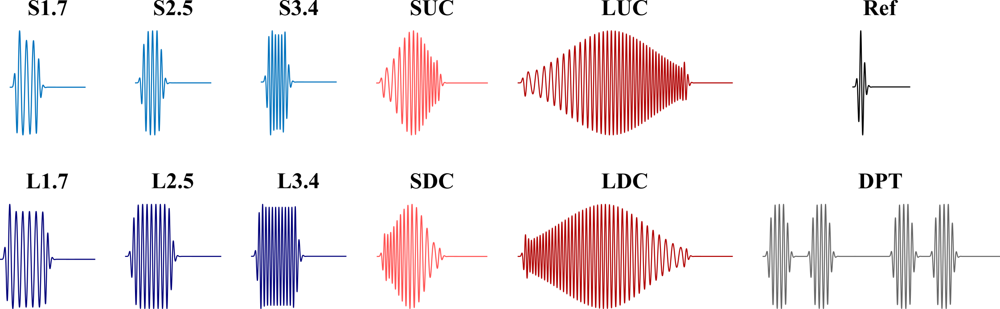
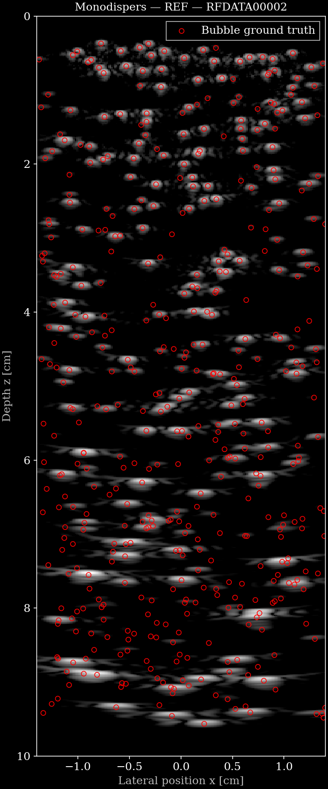
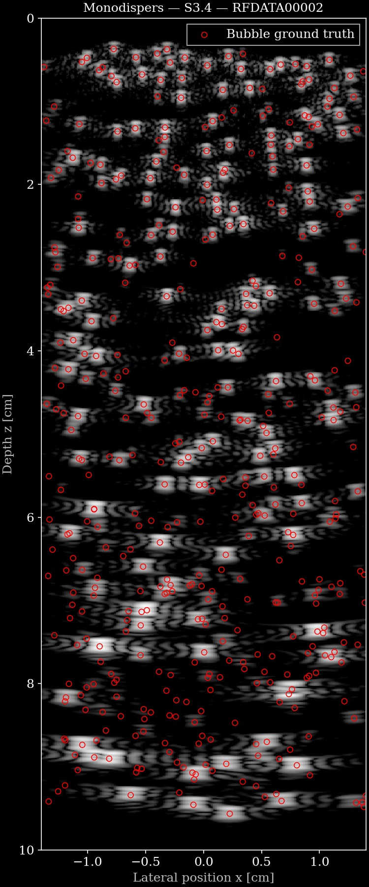

# Waveform-Specific Synthetic Microbubble RF Dataset

## Dataset Description

This synthetic 3-D ultrasound dataset contains nonlinear radiofrequency (RF) responses from microbubble contrast agents for cardiovascular-flow imaging. It was generated to study the effect of ultrasound transmit-waveform shape on RF signals and deep-learning methods for microbubble super-resolution. It contains exclusively simulated data.


The 12 different driving-pulse waveforms used in this simulated dataset.


## Dataset Contributor(s)

- Rienk Zorgdrager <r.c.zorgdrager@utwente.nl> (PhD candidate, University of Twente; primary contact)
- Anass Hameddine <a.hameddine@utwente.nl> (PhD candidate, University of Twente; primary contact)
- Michel Versluis <m.versluis@utwente.nl> (Professor, physical and medical acoustics, University of Twente)
- Guillaume Lajoinie <g.p.r.lajoinie@utwente.nl> (Associate Professor, Physics of Fluids Group, University of Twente)

## Dataset Creation Date

07/12/2026

## License / Terms of Use

[Creative Commons Attribution 4.0 International (CC BY 4.0)](https://creativecommons.org/licenses/by/4.0/legalcode.en). Retain attribution and identify modifications when reusing the data.

## Intended Usage

The dataset is intended for studying the effect of transmit waveforms on deep-learning methods for microbubble super-resolution imaging.

## Dataset Characterization

- **Data collection method:** Synthetic.
- **Ground truth:** Simulated 3-D microbubble positions are stored as zea custom elements (`bubble_x`, `bubble_y`, and `bubble_z`).
- **Bubble populations:** Monodisperse bubbles with a radius of 2.4 micrometres and 5% standard deviation, and a polydisperse SonoVue population.
- **Acquisition system:** An experimentally calibrated virtual ATL P4-1 transducer with 96 elements, realistic 3-D plane-wave pressure fields, a 62.5 MHz RF sampling rate, and 12 transmit waveforms. The overall probe dimensions are 0.02854 m × 0.016 m; each element is 0.000245 m wide and 0.016 m high. Its official nominal operating band is 1.0e6–4.0e6 Hz.
- **Simulation scale:** Up to 27.5 microbubbles/cm³, with 250 random bubble distributions per population.
- **Bubble-response model:** The implementation is a modified private derivative of the simulator described in Zorgdrager et al. (2025). It uses a custom, parallelized radial microbubble-response solver based on the Rayleigh–Plesset equation and adds 3-D realistic pressure-field calculation and coupling for the calibrated virtual ATL P4-1. The exact source-code version was not separately recorded; the dataset was generated with the internal label **private dataset-generation release 2026-07-12**. The solver source is private and is not distributed with this dataset.

## Processing the Dataset

The acquisitions can be processed with the `reconstruct.py` [script](https://github.com/open-h/OpenH-RF/blob/main/datasets/twente-microbubblesim/reconstruct.py) as provided in the [OpenH-RF GitHub repository](https://github.com/open-h/OpenH-RF), together with the pipeline definitions in `pipeline/` and the [zea library](https://github.com/tue-bmd/zea). The script streams the data from the Hugging Face Hub.

Every pulse track has its own verified pipeline file, `pipeline/pipeline_track_<index>_<label>.yaml`, all defining the same chain:

`demodulate → downsample (factor 1) → delay-and-sum beamform → envelope detect → normalize → log compress`

Each pipeline's `parameters:` block carries that pulse's beamforming peak-time reference `t_peak` (copied from `custom/track_i_t_peak`, identical in every file), the lateral field of view and the dynamic range. `zea` renders the B-mode straight from the Hub with one of these files; pass the matching track index with `--track`. Try it out with the following command:

```bash
zea process \
  --dataset hf://nvidia/OpenH-RF/twente-microbubblesim/data/Monodispers/RFDATA00002.hdf5 \
  --config hf://nvidia/OpenH-RF/twente-microbubblesim/pipeline/pipeline_track_6_REF.yaml \
  --track 6
```

In `reconstruct.py`, set `ZEA_FILE` to one `.hdf5` acquisition and `PULSE` to the pulse label (for example `REF`, `DPT` or `L1.7`); the script picks the matching track and pipeline and overlays the ground-truth bubble positions on the B-mode.

## Dataset Format

[zea v0.1.6](https://github.com/tue-bmd/zea)

Each bubble distribution is stored in one zea HDF5 file containing 12 pulse tracks. The raw channel data in every `tracks/track_i/data/raw_data` dataset have shape `(1, 1, 8446, 96, 1)`: one frame, one transmit, 8,446 time samples, 96 receive elements, and one real RF channel. RF values are `float32`; their absolute amplitude unit remains source-defined.

The complete track hierarchy is:

    tracks/ ├── track_0/ │   ├── label              # scalar string: DPT │   ├── data/raw_data │   ├── scan/ │   └── transmit_only ├── track_1/               # label: L1.7 ├── ... └── track_11/              # label: SUC

Each track stores one pulse variant. The fixed mapping for `track_0` through `track_11` is `DPT`, `L1.7`, `L2.5`, `L3.4`, `LDC`, `LUC`, `REF`, `S1.7`, `S2.5`, `S3.4`, `SDC`, and `SUC`. Every track has its own canonical scalar `label` dataset. The same ordered names are also stored in `custom/pulse_names`. The tracks are independent pulse variants for the same bubble realization, not a temporal sequence; no `track_schedule` is used.

Track-specific pulse metadata use names such as `custom/track_0_pulse_waveform` and `custom/track_0_t_peak`. The `scan` group contains sampling, transmit, timing, focus, steering, and apodization parameters. `transmit_only` is false because each track contains receive RF data. The probe geometry is stored at `probe/probe_geometry` with shape `(96, 3)`, one `(x, y, z)` position per receive element in metres. Element dimensions are stored at `probe/element_width` (`0.000245` m) and `probe/element_height` (`0.016` m). Overall probe dimensions are stored in metres as custom fields `probe_overall_width` (`0.02854`) and `probe_overall_height` (`0.016`). The official nominal P4-1 bandwidth is stored in `custom/probe_nominal_bandwidth_lower_frequency` and `custom/probe_nominal_bandwidth_upper_frequency` as 1.0e6–4.0e6 Hz.

The conversion preserves the source RF traces and the available bubble, domain, and pulse metadata. It does not refocus or demodulate RF data before packaging. The source pulse waveforms were sampled at 250 MHz.

### Pulse labels

The meanings and waveform values below are from Table I of Zorgdrager et al. (2025), [doi:10.1109/TUFFC.2025.3537298](https://doi.org/10.1109/TUFFC.2025.3537298).

| Track | Label meaning | Frequency / sweep |
|---:|---|---:|
| `track_0` / DPT | Delay-encoded pulse train (4 × S2.5) | 2.5 MHz |
| `track_1` / L1.7 | Long single-frequency pulse | 1.7 MHz |
| `track_2` / L2.5 | Long single-frequency pulse | 2.5 MHz |
| `track_3` / L3.4 | Long single-frequency pulse | 3.4 MHz |
| `track_4` / LDC | Long downsweep chirp | 4.0 → 1.2 MHz |
| `track_5` / LUC | Long upsweep chirp | 1.2 → 4.0 MHz |
| `track_6` / REF | Reference pulse | 2.5 MHz |
| `track_7` / S1.7 | Short single-frequency pulse | 1.7 MHz |
| `track_8` / S2.5 | Short single-frequency pulse | 2.5 MHz |
| `track_9` / S3.4 | Short single-frequency pulse | 3.4 MHz |
| `track_10` / SDC | Short downsweep chirp | 4.0 → 1.2 MHz |
| `track_11` / SUC | Short upsweep chirp | 1.2 → 4.0 MHz |

## Dataset Quantification

**Current OpenH-RF release:** 500 HDF5 files; 17.03 GB (17,029,267,456 bytes) stored; root `zea_version` **0.1.6**. Sizes include all HDF5 contents and use decimal units (MB = 10^6 bytes, GB = 10^9 bytes, TB = 10^12 bytes), not decoded-array memory or original-source download sizes.

- **Acquisition files:** 500 files, each with 12 one-frame pulse tracks (6,000 track acquisitions total).
- **Organization:** Two bubble populations × 250 files × 12 pulse tracks.
- **Total consolidated HDF5 size:** 17.03 GB (17,029,267,456 bytes).

| Feature | Shape | Dtype | Units | Description |
|---|---:|---|---|---|
| `raw_data` | `(1, 1, 8446, 96, 1)` | `float32` | Source-defined RF amplitude | Raw RF channel data |
| `probe_geometry` | `(96, 3)` | `float32` | m | Element positions `(x, y, z)` |
| `bubble_x`, `bubble_y`, `bubble_z` | `(N_bubbles,)` | `float32` | Source-defined | Ground-truth microbubble positions |
| `bubble_initial_r0`, `bubble_r0`, `bubble_p_db` | `(N_bubbles,)` | `float32` | Source-defined / dB | Bubble simulation parameters |
| `pulse_waveform` | Source-dependent | Source-dependent | Source-defined | Simulated transmit waveform |

### Custom Field Naming Migration

The zea 0.1.6 migration uses the following lowercase custom-field names:

| Original path | Migrated path |
|---|---|
| `custom/bubble_R0` | `custom/bubble_initial_r0` |
| `custom/bubble_p_dB` | `custom/bubble_p_db` |
| `custom/track_<i>_pulse_A` | `custom/track_<i>_pulse_a` for tracks 0 through 11 |

In the [upstream simulator](https://github.com/POF-ultrasound/super-resolution-waveforms/blob/main/RF_simulator/microbubble-simulator/main.m), `R0` is the initial microbubble radius in metres, whereas `r0` is the distance from the bubble to the pressure sensor in metres. The distinct `custom/bubble_r0` field is therefore retained unchanged, not merged with `custom/bubble_initial_r0`. These definitions describe the public upstream implementation; the dataset uses a private derivative. Existing stored units and values are preserved, not inferred or rescaled during migration.

All 14 renames preserve array values, shapes, dtypes, and existing attributes. Each renamed dataset records its original name in `source_custom_name`. The current release uses the migrated names; older revisions use the original names. The loading helper accepts both; new consumers should use the migrated paths.

## Subject Metadata

This fully synthetic dataset contains no human or animal subjects, protected health information, age, sex, pathology, consent records, or clinical scanner identifiers.

## Data Validation

All 500 HDF5 files were checked for the expected zea container structure, 12 ordered and labelled tracks, RF shape `(1, 1, 8446, 96, 1)`, and track-specific pulse metadata. The original submission passed zea 0.1.2 validation. Representative RF traces and pulse waveforms were also compared with their pulse-folder sources with no mismatch.

<table>
  <tr>
    <td align="center"><strong>Monodispers — REF</strong><br>
      
    </td>
    <td align="center"><strong>Monodispers — S3.4</strong><br>
      
    </td>
  </tr>
</table>

## Known Issues

- The transmit setup is an unfocused plane wave by design: steering angle is zero, no finite focus distance is used (`infinite focus`), transmit delays are zero, and apodization is unity for every transmit element. These are intentional simulation settings rather than missing calibration fields.
- The HDF5 files store only the official nominal bandwidth endpoints (1.0–4.0 MHz). The measured transfer-function −6 dB bounds (approximately 1.52–3.70 MHz) and corresponding 83.4% fractional bandwidth are documented in this README but are not stored as HDF5 data fields.
- The simulator is a private, unpublished derivative of the cited simulator; no public software package or Git commit is required to use the released RF data. The internal dataset-generation release label is recorded in the HDF5 metadata and should be used when referring to this generation run.
- No train/validation/test split is provided.

## Ethical Considerations

The dataset is synthetic, so participant consent, de-identification, and IRB approval are not applicable. The contributors confirm that the simulation code, calibrated inputs, source data, and incorporated assets may be redistributed under the declared CC BY 4.0 license, consistent with the accepted proposal and the steering-group IP policy.

## Citation

When using the dataset, cite:

```bibtex
@ARTICLE{10858770,
  author={Zorgdrager, Rienk and Blanken, Nathan and Wolterink, Jelmer M. and Versluis, Michel and Lajoinie, Guillaume},
  journal={IEEE Transactions on Ultrasonics, Ferroelectrics, and Frequency Control}, 
  title={Waveform-Specific Performance of Deep Learning-Based Super-Resolution for Ultrasound Contrast Imaging}, 
  year={2025},
  volume={72},
  number={4},
  pages={427-439},
  keywords={Imaging;Ultrasonic imaging;Transducers;Chirp;RF signals;Superresolution;Signal to noise ratio;Signal resolution;Frequency control;Acoustics;Chirp;deep learning;flow imaging;microbubbles;super-resolution;ultrasound contrast imaging},
  doi={10.1109/TUFFC.2025.3537298}}
```