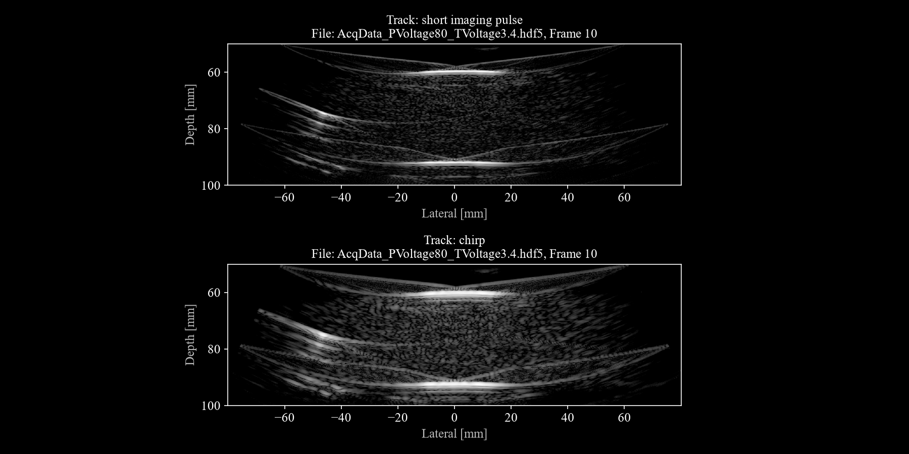
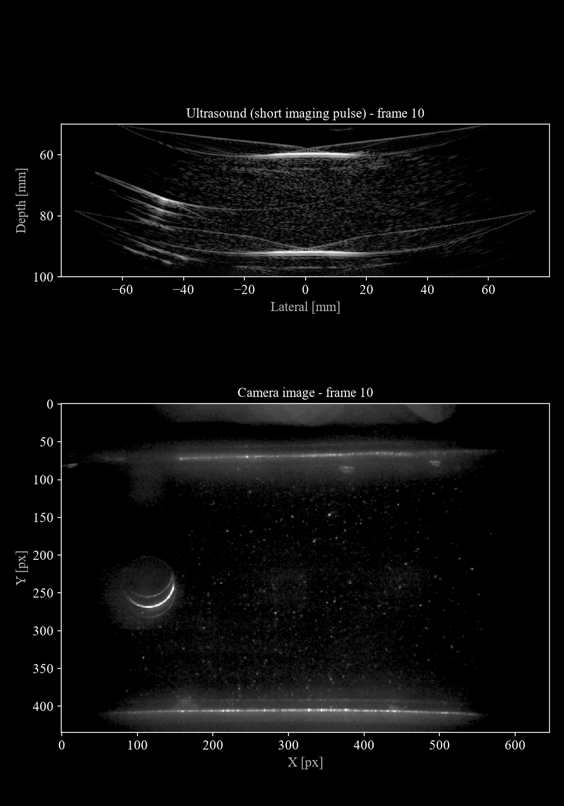

# Twente Ultrasound-Optical Flow Phantom Chamber Data

*The Photron high-speed camera view (left) and the B-mode reconstruction (right) of [`data/AcqData_PVoltage80_TVoltage3.4.hdf5`](https://huggingface.co/datasets/nvidia/OpenH-RF/blob/main/twente-vortexflow/data/AcqData_PVoltage80_TVoltage3.4.hdf5). Both come from `track_0`, frame for frame, so the optical and acoustic views show the same instant of the vortex street.*

## Dataset Description

Pre-beamformed ultrasound channel-capture data acquired with a curved-array transducer (GEC1-6D, 192 elements, 3.4 MHz center frequency) from a **flow phantom**, accompanied with simultaneously recorded camera images. The phantom contains a flow chamber through which a water with optical and acoustical scatterers is pumped at controlled flow rates. Six acquisitions are provided, spanning three pump voltage levels (80 V, 120 V, 160 V) and two transmit voltage levels (3.4 V, 7.1 V), each capturing two transmit types: a **short imaging pulse** and a **chirp** waveform. Each acquisition contains 750 frames of single plane-wave RF channel data. The intended task is **blood-flow imaging and Doppler processing** (RFP task group 6.2).

### Phantom
The front and the back of the flow chamber are made from medical-grade gelatin to facilitate ultrasound transmission. A cylinder with a diameter of 6 mm is placed inside the flow chamber which generates a von Kármán vortex street. The distance between the walls of the flow chamber is about 3 cm. A schematic of the setup is shown in Figure 1.

The elevation focus of the transducer is aligned with the optical light sheet, see Figure 2.

### Contrast
Optical scattering was facilitated by hollow glass beads (mean particle size: 9-13 micrometer, Manufacturer: Sigma-Aldrich, PubChem Substance ID: 24867590). The acoustical scatter was enhanced by adding in-house produced microbubbles. The microbubble size distribution is shown in Figure 3.

### Acquisition parameters
The acquisition settings for all six datasets are summarized in Table 1.

**Table 1. Acquisition parameters per dataset.**

| Dataset number | Dataset name                         | Transformer output (V) | Est. pump output (L/s) | Transducer driving (V) |
|---|---|---:|---:|---:|
| 1 | AcqData_PVoltage80_TVoltage3.4  | 80  | 0.056 | 3.4 |
| 2 | AcqData_PVoltage80_TVoltage7.1  | 80  | 0.056 | 7.1 |
| 3 | AcqData_PVoltage120_TVoltage3.4 | 120 | 0.107 | 3.4 |
| 4 | AcqData_PVoltage120_TVoltage7.1 | 120 | 0.107 | 7.1 |
| 5 | AcqData_PVoltage160_TVoltage3.4 | 160 | 0.138 | 3.4 |
| 6 | AcqData_PVoltage160_TVoltage7.1 | 160 | 0.138 | 7.1 |

## Dataset Contributor(s)

- Rienk Zorgdrager <r.c.zorgdrager@utwente.nl> (ORCiD: 0009-0001-2537-117X)
- Guillaume Lajoinie
- Michel Versluis
- Physics of Fluids Group, Faculty of Science and Technology, University of Twente

## Dataset Creation Date

07/01/2026

## License / Terms of Use

[Creative Commons Attribution 4.0 International (CC BY 4.0)](https://creativecommons.org/licenses/by/4.0/legalcode.en). Retain attribution and identify modifications when reusing the data.

## Intended Usage

Suitable for research in:
- Ultrasound localization microscopy (ULM) / super-resolution flow imaging
- Validation/verification of ultrasound flow imaging techniques using optical references
- Fluid dynamics using ultrasound
- Chirp compression and coded-excitation beamforming
- Beamforming quality comparison across transmit voltage levels (SNR studies)

## Dataset Characterization

- **Data Collection Method:** Phantom / table-top (flow phantom, no human subjects)
- **Labeling Method:** No manual labels; ground-truth flow rate is implicit in camera images. Note that the measured velocity may differ from the pump output in Table 1 due to changes in geometry and flow profiles in the flow chamber.
- **Acquisition system:**
  - Transducer: GEC1-6D curved array, 192 elements, 3.4 MHz center frequency, 95% bandwidth, 35 µm element width, 66 mm elevation focus, 0.0568 m radius
  - Transmit: diverging wave (no transmit delays, so the diverging nature is induced by the curvature of the surface)
  - Sampling rate: ~19.2 MHz
  - Sound speed used: 1509.6 m/s (water-based phantom)
  - Data type: raw RF (n_ch = 1, float32)
  - System: Verasonics Vantage 256

## Processing the Dataset

The acquisitions can be processed with the `reconstruct.py` [script](https://github.com/open-h/OpenH-RF/blob/main/datasets/twente-vortexflow/reconstruct.py) as provided in the [OpenH-RF GitHub repository](https://github.com/open-h/OpenH-RF), together with the pipeline definitions in this folder and the [zea library](https://github.com/tue-bmd/zea). The script streams the data from the Hugging Face Hub.

`ZEA_FILE` and `FRAME` at the top of the script select the acquisition and frame; each track is reconstructed with its own pipeline (`pipeline_short_imaging_pulse.yaml`, `pipeline_chirp.yaml`).

## Dataset Format

[zea v0.1.6](https://github.com/tue-bmd/zea)

All files are in the **zea** format (HDF5 + zea schema, current release `zea_version` 0.1.6). Each `.hdf5` file contains two tracks:

**Table 2. Track labels.**

| Track label             | Description                                         |
|-------------------------|-----------------------------------------------------|
| `short imaging pulse`   | Standard narrow-band pulse transmit                 |
| `chirp`                 | Frequency-swept (chirp) coded excitation transmit   |

Both tracks use the same probe and geometry. The raw channel data arrays are stored as `float32` and are pre-beamformed (not yet envelope-detected or log-compressed).

No pre-processing (demodulation, decimation, filtering) has been applied before packaging.

## Dataset Quantification

**Current OpenH-RF release:** 6 HDF5 files; 9.09 GB (9,088,991,232 bytes) stored; root `zea_version` **0.1.6**. Sizes include all HDF5 contents and use decimal units (MB = 10^6 bytes, GB = 10^9 bytes, TB = 10^12 bytes), not decoded-array memory or original-source download sizes.

**Table 3. Acquisition settings.**

| File                                    | Pump V | TX V | Frames per track | Tracks | Stored HDF5 size |
|-----------------------------------------|--------|------|--------|--------|-----------------|
| AcqData_PVoltage80_TVoltage3.4.hdf5    | 80 V   | 3.4 V | 750  | 2      | 1.44 GB |
| AcqData_PVoltage80_TVoltage7.1.hdf5    | 80 V   | 7.1 V | 750  | 2      | 1.55 GB |
| AcqData_PVoltage120_TVoltage3.4.hdf5   | 120 V  | 3.4 V | 750  | 2      | 1.50 GB |
| AcqData_PVoltage120_TVoltage7.1.hdf5   | 120 V  | 7.1 V | 750  | 2      | 1.54 GB |
| AcqData_PVoltage160_TVoltage3.4.hdf5   | 160 V  | 3.4 V | 750  | 2      | 1.51 GB |
| AcqData_PVoltage160_TVoltage7.1.hdf5   | 160 V  | 7.1 V | 750  | 2      | 1.55 GB |

**Total frames:** 9,000 (6 files × 750 frames), each covering 2 transmit types.  
- **Stored HDF5 size:** 9.09 GB (9,088,991,232 bytes). **No train/validation/test split** is defined; all acquisitions are provided as-is.

### Per-sample feature table

**Table 4. Per-sample features.**

| Name                  | Shape (per frame)     | Dtype   | Units | Description                                           |
|-----------------------|-----------------------|---------|-------|-------------------------------------------------------|
| `raw_data`            | (1, 3456, 192, 1)     | float32 | —     | Pre-beamformed RF channel data (1 plane-wave TX)      |
| `image/values`        | (646, 435)            | uint8   | —     | Pre-computed B-mode image (stored in file, uint8)     |
| `scan/sampling_frequency` | scalar           | float32 | Hz    | A/D sampling rate (~19.2 MHz)                         |
| `scan/sound_speed`    | scalar                | float32 | m/s   | Speed of sound used for reconstruction (~1509.6 m/s) |
| `scan/t0_delays`      | (1, 192)              | float32 | s     | Per-element transmit delays (plane-wave: all zeros)   |
| `scan/tx_apodizations`| (1, 192)              | float32 | —     | Transmit apodization (all ones = uniform)             |
| `scan/tgc_gain_curve` | (3456,)               | float32 | dB    | Time-gain compensation curve                          |
| `probe/probe_geometry`| (192, 3)              | float32 | m     | Element positions (x, y, z) in metres                 |

## Subject Metadata

This is a **phantom dataset** (no human or animal subjects). Flow rates are controlled by pump voltage (80 V, 120 V, 160 V), see Table 1.

## Data Validation

`reconstruct.py` uses one pipeline YAML file per track:
- `pipeline_short_imaging_pulse.yaml` — for the short imaging pulse track
- `pipeline_chirp.yaml` — for the chirp track

The pipeline applies: `Cast(float32) → Demodulate → Beamform(DAS, 100 patches) → EnvelopeDetect → Normalize → LogCompress`

Reference B-mode image (AcqData_PVoltage80_TVoltage3.4.hdf5, frame 10):

*Top: short imaging pulse track. Bottom: chirp track. Two horizontal phantom wall reflections are visible, with a speckle-filled flow chamber between them. Near-field reverberation and grating-lobe artifacts at the walls and the cylinder are acquisition-induced.*

Reference mapping between camera and ultrasound image (AcqData_PVoltage80_TVoltage3.4.hdf5, frame 10):

*Top: short imaging pulse track. Bottom: synchronized camera recording. The walls of the phantom and the cylinder are visible in both images. In the ultrasound image, speckle is visible in between the walls (mainly bubble induced), whereas in the camera image the contrast is induced by the hollow glass beads. Light reflection artefacts are visible in the camera image near the cylinder and the walls.*

## Known Issues
- The ultrasound recordings made with the chirp contain clipped reflections at the interface between walls and the water.
- The speed of sound differs between the water and the medical gelatin (1449.30 +- 3.37 m/s).
- A chirp compression algorithm is not provided.
- The center frequency of the chirp is determined as the mean of the input frequency for the associated cycle in the Verasonics. This may therefore only be considered a very rough estimation.
- An image registration algorithm is not provided, but the camera pixel size can be estimated using the geometry of the flow chamber.

## Ethical Considerations

This is a **phantom dataset** with no human or animal subjects. No IRB approval or informed consent is required. No personally identifiable information is present.

The phantom and flow phantom components do not carry proprietary IP constraints.
