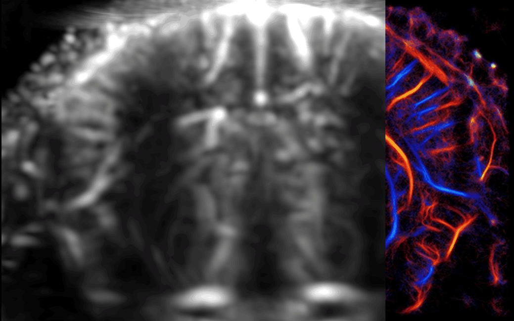

# ULMShare — in vivo mouse transcranial ULM



*Ultrasound localization microscopy (ULM) super-resolution reconstruction of a mouse brain from the ULMShare dataset.*

## Dataset Description

Pre-beamformed, plane-wave **IQ channel data** from transcranial ultrasound localization microscopy (ULM) of the mouse brain, converted from the public [ULMShare](https://arxiv.org/abs/2606.07851) release into the zea format. Each acquisition is a contrast-enhanced (microbubble) plane-wave sequence over the intact skull of an anesthetized mouse; compounding the transmits gives a Power-Doppler movie of the cerebral microvasculature, and localizing and tracking individual microbubbles across frames gives a super-resolved density map of the vessels.

This is **in vivo animal data**, not phantom or simulated. It is a conversion of the upstream release, which holds 99 acquisitions from 61 mice (approximately 30 TB of original-source raw data, distinct from the stored HF release below) recorded between March 2022 and March 2025 at the Provost Ultrasound Lab (Polytechnique Montréal) and partner sites.

## Dataset Contributor(s)

**Original dataset (ULMShare)** — Provost Ultrasound Lab, Polytechnique Montréal:

- Brice Rauby
- Nin Ghigo
- Gerardo Ramos-Palacios
- Alexis Leconte
- Stephen A. Lee
- Alice Wu
- Paul Xing
- Oleksandra Gulenko
- Louis Caron
- Antoine Malescot
- Eric Martineau
- Jonathan Porée
- Maxime Gasse
- Ravi L. Rungta
- Abbas F. Sadikot
- Jean Provost

**zea conversion and reconstruction (this submission):**

- Oisín Nolan <o.i.nolan@tue.nl> (Eindhoven University of Technology)

## Dataset Creation Date

08/21/2026 (zea conversion). The underlying acquisitions were recorded between March 2022 and March 2025.

## License / Terms of Use

[Creative Commons Attribution 4.0 International (CC BY 4.0)](https://creativecommons.org/licenses/by/4.0/legalcode.en). Retain attribution and identify modifications when reusing the data.

## Intended Usage

Ultrasound localization microscopy: microbubble detection and localization, frame-to-frame tracking, super-resolved vascular density and velocity mapping, and clutter filtering / tissue suppression.

## Dataset Characterization

- **Data Collection Method:** in vivo animal (mouse), contrast-enhanced.
- **Labeling Method:** none. A reference ULM density map rendered by the original authors is stored alongside the acquisitions as a `density_map` custom element — a visualization, not a ground-truth label.
- **Acquisition system:** Verasonics Vantage 256. See files for further acquisition details.

## Processing the Dataset

The acquisitions can be processed with the `reconstruct.py` [script](https://github.com/open-h/OpenH-RF/blob/main/datasets/ulmshare/reconstruct.py) as provided in the [OpenH-RF GitHub repository](https://github.com/open-h/OpenH-RF), together with the `pipeline_bmode.yaml` and `pipeline_tissue_suppression.yaml` definitions in this folder and the [zea library](https://github.com/tue-bmd/zea). The script streams the data from the Hugging Face Hub and writes a B-mode, a power-Doppler image and movie, and a ULM density map (the ULM steps live in [`ulm.py`](https://github.com/open-h/OpenH-RF/blob/main/datasets/ulmshare/ulm.py)).

## Dataset Format

[zea v0.1.4](https://github.com/tue-bmd/zea)

zea (HDF5), current release `zea_version` 0.1.4.

Each acquisition is **one HDF5 file with a single track**.

```
/
├── probe/                       name, type, probe_geometry, probe_center_frequency
├── metadata/
│   ├── credit                   DOI of the ULMShare publication
│   ├── subject/                 id, type, sex, genetic_strain, weight
│   └── text_report              procedure notes (where recorded)
├── custom/                      acquisition context (see table below)
└── tracks/track_0/
    ├── data/raw_data            (n_frames, n_tx, n_ax, n_el, 2) int16
    ├── scan/                    sampling_frequency, center_frequency,
    │                            demodulation_frequency, sound_speed,
    │                            initial_times, t0_delays, polar_angles,
    │                            azimuth_angles, focus_distances,
    │                            transmit_origins, tx_apodizations,
    │                            tgc_gain_curve
    └── transmit_only            False
```

**Large acquisitions split for upload:** The HuggingFace file-size limit is 500 GB. Four acquisitions are near or above it, so each one is split into two parts. These are `mouse_58/acquisition_1` (616 GB) and `mouse_59/acquisition_1` to `acquisition_3` (499 GB each). The split is at frame 240,000, into `_part1of2.hdf5` and `_part2of2.hdf5`. Both parts hold the same metadata: probe geometry, subject information, and clinical fields. To rebuild an acquisition, join `raw_data` from the two parts along axis 0.

### Per-sample feature table

| Feature | Shape | Dtype | Units | Description |
|---|---|---|---|---|
| `data/raw_data` | `(n_frames, n_tx, n_ax, n_el, 2)` | `int16` | ADC counts | Baseband IQ channel data, `[I, Q]` (`I + jQ`) |
| `probe/probe_geometry` | `(n_el, 3)` | `float32` | m | Element positions `(x, y, z)` |
| `probe/probe_center_frequency` | `()` | `float32` | Hz | Probe center frequency |
| `scan/sampling_frequency` | `()` | `float32` | Hz | IQ sampling rate (`fc` for BS100BW, `fc/2` for BS50BW) |
| `scan/center_frequency`, `scan/demodulation_frequency` | `()` | `float32` | Hz | Transmit carrier / demodulation frequency |
| `scan/sound_speed` | `()` | `float32` | m/s | 1540 |
| `scan/polar_angles` | `(n_tx,)` | `float32` | rad | Plane-wave steering angles, ping-pong order |
| `scan/azimuth_angles` | `(n_tx,)` | `float32` | rad | Zero (2D imaging) |
| `scan/focus_distances` | `(n_tx,)` | `float32` | m | `inf` (unfocused plane waves) |
| `scan/t0_delays` | `(n_tx, n_el)` | `float32` | s | Transmit delays, min 0 |
| `scan/initial_times` | `(n_tx,)` | `float32` | s | Zero (MUST adds no per-transmit offset) |
| `scan/tx_apodizations` | `(n_tx, n_el)` | `float32` | – | Ones (full aperture; see Known Issues) |
| `scan/transmit_origins` | `(n_tx, 3)` | `float32` | m | Zero |
| `scan/tgc_gain_curve` | `(n_ax,)` | `float32` | – | 8 source control points interpolated per sample |
| `metadata/subject/weight` | `()` | `float32` | kg | Mouse body weight |
| `custom/density_map` | `(H, W, 3)` or `(H, W)` | `uint8` | – | Reference ULM density map PNG |

### Custom elements

Acquisition context with no zea spec field, stored as strings exactly as recorded upstream: `anesthesia`, `injection_type`, `mb_dilution`, `volume_mb_injected`, `frame_rate_hz`, `npulse`, `voltage`, `mouse_weight`, `mouse_age_days`, `mouse_animal_protocol_id`, `flush`, and (where non-blank) `procedure_type`, `slice_position`, `temperature`, `syringe_gauge`.

## Dataset Quantification

**Current OpenH-RF release:** 103 HDF5 files; 20.74 TB (20,735,658,275,478 bytes) stored; root `zea_version` **0.1.4**. Sizes include all HDF5 contents and use decimal units (MB = 10^6 bytes, GB = 10^9 bytes, TB = 10^12 bytes), not decoded-array memory or original-source download sizes.

- **Acquisitions:** 99, from 61 mice — one zea HDF5 file per acquisition.
- **Stored HDF5 size:** 20.74 TB (20,735,658,275,478 bytes).
- **Split:** none.

## Subject Metadata

Aggregate only; the subjects are mice, so no PHI applies. Subject attributes are counted per mouse (n = 61); probe and imaging plane per acquisition (n = 99).

- **Subjects:** 61 mice, 99 acquisitions.
- **Sex:** 36 female, 22 male, 3 unrecorded.
- **Strain:** C57BL/6J (48), C57BL/6N (13).
- **Age:** 22–216 days (recorded for 56 of 61).
- **Weight:** 11.3–31.0 g (recorded for 55 of 61).
- **Anatomy:** whole-brain transcranial, through the intact skull. An imaging plane is named for 23 of 99 acquisitions: striatum, hippocampus, midbrain, pons, cerebellum.
- **Pathology:** none — all animals are healthy.
- **Probe model:** L22-14v (77), GEL818iD (15), L22-14vX (7).
- **Sites:** McGill University (43 mice), ICM / Paris Brain Institute (12), Université de Montréal (6).

## Data Validation

- Standard B-mode and B-mode with tissue suppression `zea` pipelines available in `pipeline_bmode.yaml` and `pipeline_tissue_suppression.yaml`, respectively.

## Known Issues
- The metadata of mice 55 56 and 57 should not mark them as air puff. Only mice 58, and 59 acq 1 and 3 have should be marked air puff.
- The metadata should include a `brain` anatomy label.
- `zea` version for the files is not up-to-date.

## Ethical Considerations

- **Data tier:** in vivo animal (mouse). No human subjects, no protected health information, and no participant-consent or IRB requirement applies.
- **Animal use approval:** acquisitions were performed under an institutional animal use protocol. `custom/mouse_animal_protocol_id` records the identifier per acquisition. Recording sites are McGill University, the ICM (Institut de cardiologie de Montréal), and Université de Montréal. The approval statements themselves belong to the original ULMShare authors and should be reproduced from their publication when this conversion is published, rather than inferred from the protocol identifiers alone.
- **Animal welfare (ARRIVE 2.0):** the essential-10 reporting items that this dataset can carry are recorded per acquisition and summarized under Subject Metadata — species and strain, sex, age, weight, health status (all healthy; no disease model), anesthetic protocol, contrast-agent route and dose, and recording site. Items that belong to the original study design rather than the released data — sample-size rationale, randomization, blinding, and outcome definitions — are not reproduced here and should be taken from the ULMShare publication.
- **De-identification:** not applicable to animal subjects. Subject IDs are coded (`mouse_18`), and no date of birth is carried into the zea files — only age in days.
- **Procedures:** no terminal procedure is represented; imaging is transcranial through the intact skull.

## Citation

CC BY 4.0 requires attribution to the original authors. Cite the **dataset**:

Rauby, B., Ghigo, N., Ramos-Palacios, G., Leconte, A., Lee, S., Wu, A., Xing, P., Gulenko, O., Caron, L., Malescot, A., Martineau, É., Porée, J., Gasse, M., Rungta, R., Sadikot, A., Provost, J. (2026). *ULMShare: A Large-Scale In Vivo Ultrasound Localization Microscopy Dataset for Microvascular Imaging.* Federated Research Data Repository. [doi:10.20383/103.01550](https://doi.org/10.20383/103.01550)

and, where the methods are relevant, the accompanying preprint: [arXiv:2606.07851](https://doi.org/10.48550/arXiv.2606.07851).

Note that `metadata/credit` inside the converted files carries the source `acquisition.json`'s `doi_citations` where those are recorded, and otherwise falls back to the preprint DOI above; the FRDR dataset DOI is the canonical citation target for the data itself.
