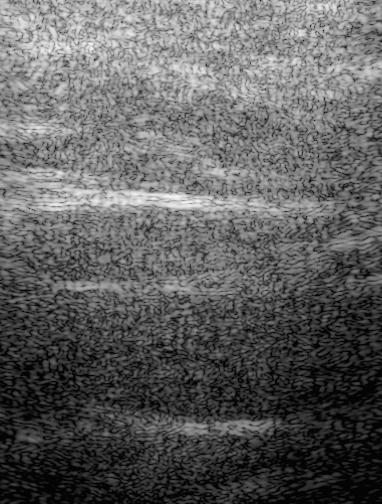
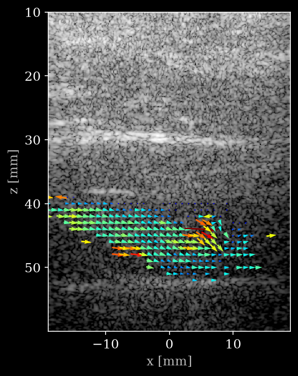

# UW-FemVein RF



*Cine loop of [`data/Acq0.hdf5`](https://huggingface.co/datasets/nvidia/OpenH-RF/blob/main/waterloo-largeartery/data/Acq0.hdf5), rendered from provided velocity fields.*

## Dataset Description

Raw RF frames (plane wave) and vector flow profiles of the human femoral vein, acquired by the VORTEX research group at the University of Waterloo with a programmable research scanner configured for high-frame-rate vector flow imaging. The data was collected to study venous hemodynamics under muscular contraction and head-up tilt.

## Dataset Contributor(s)

- Hassan Nahas <hassan.nahas@uwaterloo.ca>
- Jeremy N. Cohen
- Eudoxia Zafiris
- Skye H.T. Ling
- Alfred C.H. Yu
- Jason S. Au <jason.au@uwaterloo.ca>
- VORTEX, University of Waterloo

## Dataset Creation Date

08/20/2026

## License / Terms of Use

[Creative Commons Attribution 4.0 International (CC BY 4.0)](https://creativecommons.org/licenses/by/4.0/legalcode.en). Retain attribution and identify modifications when reusing the data.

## Intended Usage

Developing, benchmarking, and evaluating methods for ultrasound image reconstruction, motion estimation, clutter filtering, multi-angle Doppler processing, and vector flow imaging (VFI) in venous imaging.

## Dataset Characterization

- **Data Collection Method:** In vivo imaging of human femoral veins.
- **Labeling Method:** Label contains target vessel (Anatomy), view direction (Longitudinal), and physiological condition (Contraction + head up tilt).
- **Acquisition system:** Raw RF data was acquired from programmable research scanners (US4R, US4US, Warsaw, Poland) equipped with an AL2442 linear array transducer.

## Processing the Dataset

The acquisitions can be processed with the `pipeline.yaml` definition in this folder and the [zea library](https://github.com/tue-bmd/zea).

`zea` streams the data from the Hugging Face Hub and processes it according to the pipeline. You can try it out with the following command:

```bash
zea process \
  --dataset hf://nvidia/OpenH-RF/waterloo-largeartery/data/Acq0.hdf5 \
  --config hf://nvidia/OpenH-RF/waterloo-largeartery/pipeline.yaml \
  --n-frames 1 \
  --save-as png
```

Alternatively, you can use the `reconstruct.py` [script](https://github.com/open-h/OpenH-RF/blob/main/datasets/waterloo-femoralvein/reconstruct.py) as provided in the [OpenH-RF GitHub repository](https://github.com/open-h/OpenH-RF).

Swap `--n-frames 1 --save-as png` for `--save-as gif` to get the cine loop. In the script, `ZEA_FILE`, `FRAME`, `POWER_THRESHOLD` (the power-Doppler mask threshold, in dB), `VMAX` (velocity colour-scale maximum) and `NO_DEALIAS` at the top select what is reconstructed and overlaid.

## Dataset Format

[zea v0.1.5](https://github.com/tue-bmd/zea)

Submitted in the [`zea` file format](https://zea.readthedocs.io/en/latest/) (one HDF5 file per acquisition).

Per-sample contents of the converted HDF5:

| Group / field | Shape | Dtype | Units | Description |
|---|---|---|---|---|
| `metadata/credit` | `[]` | str | -- | Dataset attribution (LITMUS @ University of Waterloo) |
| `metadata/subject/id` | `[]` | str | -- | Participant ID (needed for subject-wise splits) |
| `metadata/subject/type` | `[]` | str | -- | Subject type (`human`) |
| `metadata/subject/age` | `[]` | uint8 | years | Subject age (`0` if not available) |
| `metadata/subject/sex` | `[]` | str | -- | Subject sex (`M` or `F`) |
| `metadata/annotations/anatomy` | `[]` | str | -- | Target artery  (`Femoral Vein`) |
| `metadata/annotations/view` | `[]` | str | -- | View orientation (`Longitudinal`) |
| `metadata/annotations/label` | `[]` | str | -- | Physiological condition ('Contraction 8Kg HUT 40') |
| `probe/name` | `[]` | str | -- | Probe identifier (`AL2442`) |
| `probe/type` | `[]` | str | -- | Probe structure type (`linear`) |
| `probe/probe_geometry` | `[192, 3]` | float32 | m | Transducer element Cartesian positions (x, y, z) |
| `data/raw_data` | `[n_frames, n_tx, n_ax, n_el, 1]` | float32 | -- | Raw RF channel data |
| `data/image` | `[n_frames, z, x]` (+ `coordinates` `[z, x, 3]`) | float32 | dB | Stored log-compressed B-mode intensity (relative to peak) |
| `data/vector_velocity_x` | `[n_frames, z, x]` (+ `coordinates` `[z, x, 3]`) | float32 | m/s | Lateral component of vector velocity ($v_x$) |
| `data/vector_velocity_z` | `[n_frames, z, x]` (+ `coordinates` `[z, x, 3]`) | float32 | m/s | Axial component of vector velocity ($v_z$) |
| `data/vector_velocity_x_deal` | `[n_frames, z, x]` (+ `coordinates` `[z, x, 3]`) | float32 | m/s | Lateral component of dealiased vector velocity ($v_x$) |
| `data/vector_velocity_z_deal` | `[n_frames, z, x]` (+ `coordinates` `[z, x, 3]`) | float32 | m/s | Axial component of dealiased vector velocity ($v_z$) |
| `data/power_doppler` | `[n_frames, z, x]` (+ `coordinates` `[z, x, 3]`) | float32 | dB | Power Doppler intensity |
| `data/color_doppler` | `[n_frames, z, x]` (+ `coordinates` `[z, x, 3]`) | float32 | m/s | Color Doppler map |
| `scan/*` | -- | -- | -- | Probe geometry, sampling/center/demodulation frequency, t0 delays, sound speed, transmit angles, focus distances, transmit origins, apodizations, PRI... |

All `coordinates` arrays are per-pixel Cartesian positions in meters, last axis `[x, y, z]` (y = 0 for 2-D maps).


## Dataset Quantification

**Current OpenH-RF release:** 15 HDF5 files; 941.96 GB (941,958,804,227 bytes) stored; root `zea_version` **0.1.5**. Sizes include all HDF5 contents and use decimal units (MB = 10^6 bytes, GB = 10^9 bytes, TB = 10^12 bytes), not decoded-array memory or original-source download sizes.

Data was collected from 15 participants and consists of 15 acquisitions (one per participant), containing 12,000 frames of raw RF data per acquisition. Each participant performed isometric plantarflexion contractions at 8 Kg under head up tilt of 40 degrees. Each femoral vein acquisition comprises 2 steered plane-wave transmits (`n_tx = 2`), 2048/3072 axial samples, and 192 receive channels. 

## Subject Metadata

| Metric | Value |
| :--- | :--- |
| **Total Number of Subjects** | 15 |
| **Total Number of Files (Acquisitions)** | 15 |
| **Sex Composition** | M: 8, F: 7  |
| **Total RF Frames** | 180,000 |

## Known Issues

- Participants may overlap with other UWaterloo submissions.
- Due to hardware, some acquisitions may have elevated or spikey Doppler noise on the left side of the image.
- Some acquisitions may have not hit the target view optimally, leading to poor flow detection.
- Dealiased velocity vector fields rely on speckle tracking which may be more sensitive to noise in low Doppler power conditions.

## Beamforming and Processing

1. **Pre-Filtering:** Channel RF data is pre-filtered to remove hardware artifacts and out-of-band noise using a 5 MHz bandpass filter before beamforming.
2. **GPU-Accelerated Beamforming (DAS):** Beamforming is carried out via a GPU-accelerated Delay-and-Sum (DAS) module.
   - **Aperture & Apodization:** 128-element Hanning window apodization and an F-number of 1.5.
   - **Dual Angle-Compounding:** Beamforming for B-mode and power Doppler is performed twice with opposite receive angles ($+15^{\circ}$ and $-15^{\circ}$). The final high-resolution beamformed image (HRI) is the average of these two acquisitions:
     $$HRI = \frac{HRI_{+15^{\circ}} + HRI_{-15^{\circ}}}{2}$$
   - **Reconstruction Grid:** Cartesian coordinates mapped by a `PixelMap` representing a lateral range of $[-19, 19]\text{ mm}$ and axial depth of $[10, 60]\text{ mm}$ at $0.1\text{ mm}$ spatial resolution.
3. **Clutter Filtering:** Clutter filtering is performed on the beamformed ensemble using a high-pass wall filter (normalized cut-off frequencies of 0.05 and 0.1, attenuation of 100 dB).
4. **Multi-Angle Doppler Frequency Estimation:** Angle-specific Doppler frequencies are computed using an ensemble size of 64 frames with a step size of 1.
   - For conventional vector velocity estimation, we used the following Tx-Rx angles: Tx: [-10°, -10°, 10°, 10°]; Rx: [-10°, 10°, -10°, 10°]
   - For dealiased vector velocity estimation, we used the following Tx-Rx angles: Tx: [-10°, -10°, -10°,-10°, 10°, 10°]; Rx: [-10°, -3°, 6°, 10°, -6°, 3°,10°]
   - Color Doppler map is selected as the first of these (Tx: -10°, Rx = -10°)
5. **Vector Doppler Velocity Estimation:** Lateral ($v_x$) and axial ($v_z$) velocity components are computed from the multi-angle Doppler frequency estimates using GPU-accelerated least-squares estimation. Lateral ($v_x$) and axial ($v_z$) dealiased velocity components are computed from the multi-angle Doppler frequency estimates using GPU-accelerated extended least-squares estimation.

The full LITMUS processing pipeline (GPU DAS beamforming + multi-angle vector Doppler) is documented by the contributors. That documentation is provided for provenance and reproducibility; it depends on the LITMUS core Python package and the raw acquisition frames, so it is not runnable from this folder alone.

Papers relevant to our pipeline:

J. N. Cohen, E. Zafiris, J. N. Jasiak, S. H. T. Ling, O. M. Decyk, H. Nahas, A. C. H. Yu, and J. S. Au, "The influence of aging on graded peripheral venous return and complex blood flow features through human veins." GeroScience (2026). https://doi.org/10.1007/s11357-026-02378-6

H. Nahas, B. Y. S. Yiu, A. J. Y. Chee, T. Ishii and A. C. H. Yu, "Bedside Ultrasound Vector Doppler Imaging System With GPU Processing and Deep Learning," in IEEE Transactions on Ultrasonics, Ferroelectrics, and Frequency Control, vol. 72, no. 8, pp. 1079-1094, Aug. 2025, doi: 10.1109/TUFFC.2025.3582773

B. Y. S. Yiu and A. C. H. Yu, "Least-Squares Multi-Angle Doppler Estimators for Plane-Wave Vector Flow Imaging," in IEEE Transactions on Ultrasonics, Ferroelectrics, and Frequency Control, vol. 63, no. 11, pp. 1733-1744, Nov. 2016, doi: 10.1109/TUFFC.2016.2582514

## Data Validation

`reconstruct.py` builds a `zea.Pipeline` of DAS beamforming → envelope detection → normalization → log-compression **in code** and reconstructs a B-mode directly from `raw_data`, showing the raw-to-image flow without any config file. It also saves the pipeline to `pipeline.yaml` as a shareable recipe. Comparing the reconstruction against the stored (LITMUS) B-mode is a sanity check that the acquisition parameters and probe geometry are recorded correctly, and serves as a reproducible reference reconstruction.

When the vector-flow fields (`vector_velocity_x/z`/`vector_velocity_x/z_deal` + `power_doppler`) are present, the vector velocity field is overlayed on the stored B-mode. The overlay uses `draw_velocity_field`, a single self-contained (numpy + matplotlib) helper reproduced inside `reconstruct.py` from the LITMUS core Python package (`litmus.core_py.visualization`), so the script has no dependency on the full LITMUS GPU stack.

The result is written to `reconstruct_output.png`:



## Ethical Considerations

All human studies were approved by the University of Waterloo’s Human Research Ethics Board (ORE #46018). All included data was acquired from participants who provided both written and verbal consent prior to participating in the study regarding public data sharing.

## Citation

```bibtex
@article{Cohen2026,
  author  = {Cohen, Jeremy N. and Zafiris, Eudoxia and Jasiak, Jessica N. and Ling, Skye H. T. and Decyk, Olena M. and Nahas, Hassan and Yu, Alfred C. H. and Au, Jason S.},
  title   = {The influence of aging on graded peripheral venous return and complex blood flow features through human veins},
  journal = {GeroScience},
  year    = {2026},
  issn    = {2509-2723},
  doi     = {10.1007/s11357-026-02378-6},
  url     = {https://doi.org/10.1007/s11357-026-02378-6}
}
```
