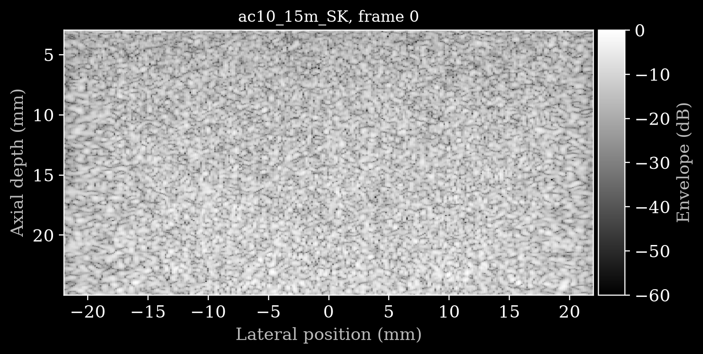

# Weill Cornell QUS Phantom Dataset



*B-mode of frame 0 of [`data/ac10_15m_SK.hdf5`](https://huggingface.co/datasets/nvidia/OpenH-RF/blob/main/weillcornell/data/ac10_15m_SK.hdf5), reconstructed from the raw RF on the common 597 x 300 grid (approximately 3-25 mm depth).*

## Dataset Description

Pre-beamformed RF channel data from three homogeneous tissue-mimicking phantoms, acquired for quantitative ultrasound (QUS). Next to the raw RF, each acquisition carries the phantom's model-derived theoretical backscatter coefficient (BSC), direct per-frame Nakagami maps, and 20-frame pooled Nakagami references, so single-frame QUS estimators can be trained and evaluated against targets stored in the same file.

## Dataset Contributor(s)

- Shangke Liu <shl4035@med.cornell.edu> (contact)
- Tipu Sultan
- Cameron Hoerig
- Jonathan Mamou
- Biomedical Ultrasound Research Laboratory (BURL), Weill Cornell Medicine

## Dataset Creation Date

Not specified by the contributors.

## License / Terms of Use

[Creative Commons Attribution 4.0 International (CC BY 4.0)](https://creativecommons.org/licenses/by/4.0/legalcode.en). Retain attribution and identify modifications when reusing the data.

## Intended Usage

1. Reconstruct B-mode from one frame of raw RF.
2. Predict the phantom's theoretical BSC curve from one RF frame. This is a material-model target, not a local experimentally estimated BSC curve.
3. Predict pooled Nakagami `m` or `omega` from one RF frame. Use the supplied direct per-frame map as the single-frame baseline.

For Nakagami predictions, report MAE/RMSE and map correlation against the pooled reference. For BSC predictions, report the frequency range and unit and state whether evaluation uses linear BSC or a specified dB conversion.

## Dataset Characterization

- **Data collection method:** phantom — three homogeneous tissue-mimicking phantoms (`15m`, `18m`, `60m`), each scanned by two operators (`SK`, `TP`) at 20 probe placements
- **Labeling method:** derived — BSC from the phantom material model; Nakagami maps estimated from the RF
- **Acquisition system:** Verasonics Vantage 256, GE9LD linear array, 192 elements, 0.23 mm pitch, 5.2083 MHz center frequency, 20.8333 MHz RF sampling
- **Transmit sequence:** one normal-incidence plane wave per frame; 1540 m/s sound speed

## Processing the Dataset

The acquisitions can be processed with the `pipeline.yaml` definition in this folder and the [zea library](https://github.com/tue-bmd/zea).

`zea` streams the data from the Hugging Face Hub and processes it according to the pipeline. You can try it out with the following command:

```bash
zea process \
  --dataset hf://nvidia/OpenH-RF/weillcornell/data/ac10_15m_SK.hdf5 \
  --config hf://nvidia/OpenH-RF/weillcornell/pipeline.yaml
```

Alternatively, you can use the `reconstruct.py` [script](https://github.com/open-h/OpenH-RF/blob/main/datasets/weillcornell/reconstruct.py) as provided in the [OpenH-RF GitHub repository](https://github.com/open-h/OpenH-RF). Besides the B-mode, it prints the selected frame's BSC band and unit, the QUS map shapes, and the error of the direct per-frame Nakagami maps against the pooled references.

## Dataset Format

[zea v0.1.6](https://github.com/tue-bmd/zea)

Each file contains one track. Raw RF is stored as `int16` ADC counts without demodulation, decimation, or resampling. The five QUS targets are zea Map fields next to `raw_data`, with Cartesian coordinates in metres. The BSC field has 157 frequency `labels` (`frequency_hz=<value>`) spanning 3.3162435-6.4900716 MHz.

Map grids are `(z,x)=(26,35)` for `15m` and `18m`, and `(53,35)` for `60m`. The analysis windows are approximately 2.96 mm axial by 4.37 mm lateral with 75% overlap. Nakagami maps use normal-incidence delay-and-sum beamforming, Hann receive apodization, and intensity-domain maximum-likelihood fitting, with `omega = E[A^2]`.

The theoretical BSC is a homogeneous phantom material property: each phantom has one curve, broadcast over space and all 20 frames. The pooled Nakagami maps are also repeated along the frame axis so every single-frame input has the same 20-frame reference. The pooled estimate includes the selected input frame.

## Dataset Quantification

**Current OpenH-RF release:** 120 HDF5 files; 1.00 GB (1,002,700,800 bytes) stored; root `zea_version` **0.1.6**. Sizes include all HDF5 contents and use decimal units (MB = 10^6 bytes, GB = 10^9 bytes, TB = 10^12 bytes), not decoded-array memory or original-source download sizes.

- **Acquisitions / frames:** 120 acquisitions (3 phantoms x 2 operators x 20 probe placements, one HDF5 file each), 20 frames per acquisition — 2,400 frames total
- **File naming:** `data/ac<n>_<phantom>_<operator>.hdf5`, with `n` from 1 to 20, e.g. `ac10_15m_SK.hdf5`
- **Splits:** no predefined train/validation/test split. Keep all frames from one acquisition in the same split.

| Field under `tracks/track_0/data/` | Shape | dtype | Unit | Meaning |
|---|---|---|---|---|
| `raw_data` | `(20,1,n_ax,192,1)` | `int16` | ADC counts | Raw RF input |
| `theoretical_bsc/values` | `(20,z,x,157)` | `float32` | `m^-1 sr^-1` | Model-derived BSC target |
| `nakagami_m_per_frame/values` | `(20,z,x)` | `float32` | `1` | Direct single-frame shape estimate |
| `nakagami_omega_per_frame/values` | `(20,z,x)` | `float32` | `a.u.^2` | Direct single-frame spread estimate |
| `nakagami_m_pooled/values` | `(20,z,x)` | `float32` | `1` | 20-frame pooled shape reference |
| `nakagami_omega_pooled/values` | `(20,z,x)` | `float32` | `a.u.^2` | 20-frame pooled spread reference |

## Subject Metadata

No human or animal subjects. `metadata/subject/type` is `phantom` and `metadata/subject/id` names the phantom (`phantom_15m`, `phantom_18m`, `phantom_60m`).

## Data Validation

A `zea.Pipeline` (cast → demodulate → DAS beamforming → envelope detection → normalization → log compression) is defined in `pipeline.yaml`, on a common 597 x 300 grid for every acquisition. Its output for frame 0 of `ac10_15m_SK` is shown at the top of this card. Raw RF and the embedded maps were checked for shape, dtype, finite values, coordinates, labels, min/max, and the frame-broadcast behavior described above.

## Known Issues

- Acquisition timestamps, PRF, explicit TGC curves, and emitted waveforms are unavailable; do not use these frames for calibrated temporal or flow analysis.
- Repeated frames are strongly correlated.
- BSC targets are model-derived references, not independent experimental BSC measurements; there are three unique phantom curves.
- Pooled Nakagami maps are lower-variance statistical references, not independent physical ground truth.
- Nakagami `omega` depends on gain, attenuation, beam sensitivity, and RF amplitude scale; it is not system-independent.

## Ethical Considerations

Phantom-only data; no human or animal subjects, clinical metadata, or PHI. The contributors confirm that these phantom data are cleared for release under CC BY 4.0.
