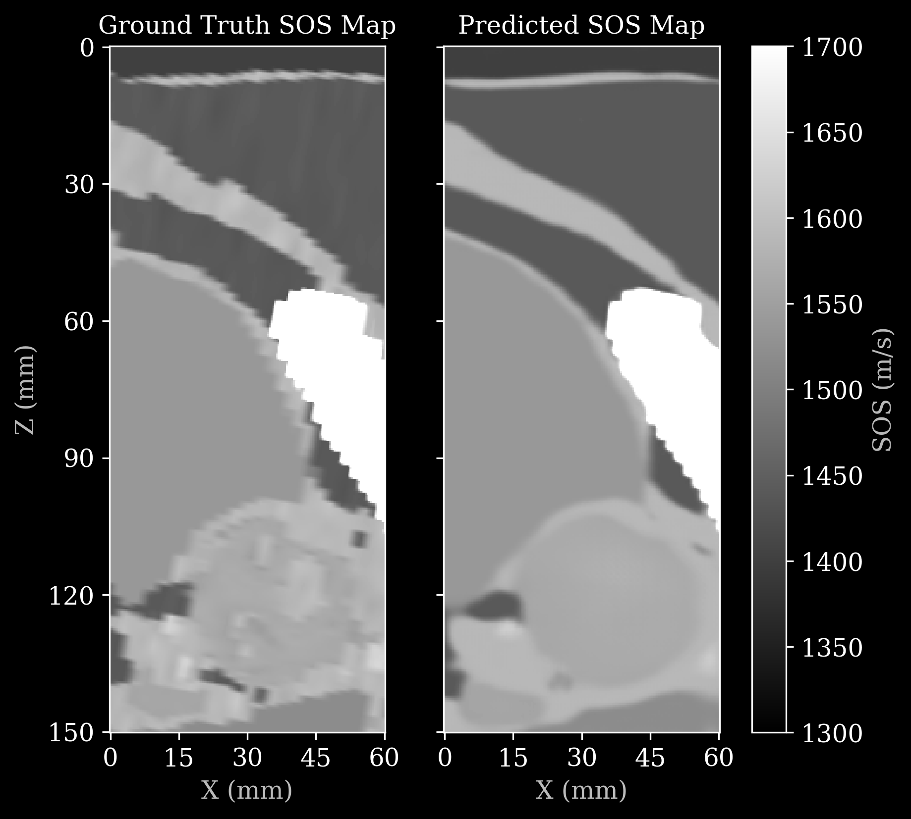

# OpenH-RF Submission Evaluation: UNC-OpenPros

**Overall verdict:** Accept with revisions
**Evaluated on:** 2026-08-31
**Reviewer:** Claude (automated)
**Source:** Google Drive `UNC-OpenPros` (folder `1_DwlOou-F-dqDAcqQfk7gda02oFl9fi0`)

> **Scope caveat — read this first.** The submission's binary files
> (`openpros_sample.hdf5`, 21.5 MB; `InversionNet_weights_only.pth`, 81.9 MB)
> could not be transferred into the evaluation environment. Three routes were
> tried and all are closed: `drive.google.com` and
> `drive.usercontent.google.com` are blocked by the network egress policy; the
> Drive API rejects unauthenticated media downloads (`403`, missing API key);
> and the Google Drive connector caps downloads at **10 MB**, which both files
> exceed. The five Python files and the reference PNG are under that cap and
> were recovered in full.
>
> **In particular, the delivered `openpros_sample.hdf5` was never opened.**
> Whether round-1 feedback is integrated *in the uploaded file* — as opposed to
> in the `convert.py` that would produce it — is therefore **not** established
> by this report. Note the Drive timestamps: `convert.py` was last modified
> 2026-08-24, and `openpros_sample.hdf5` 2026-08-25, so the sample post-dates
> the revised script and is *probably* current. `old_openpros_sample.hdf5`
> (2026-07-14, owned by a different account) appears to be the pre-fix file.
> This needs confirming against the actual bytes.
>
> To evaluate anyway, `convert.py` was run **unmodified** against synthetic
> source arrays of exactly the shapes it expects, producing a zea file that is
> **structurally identical** to the delivered one (only the payload values
> differ), and `reconstruct.py` was run **unmodified** against that file with a
> randomly-initialised InversionNet standing in for the checkpoint.
>
> Consequently every finding below about **structure, shapes, dtypes, units and
> geometry** is directly verified, while findings about the **delivered file's
> actual contents** (payload values, the real checkpoint, the `zea_version` the
> delivered file was written with) are inferred from the code that produced it.
> Re-run this report against the real HDF5 before final sign-off.

## Executive scorecard

| # | Category | Result |
|---|---|---|
| 1 | Format compliance | ✅ PASS |
| 2 | Reconstruction & image quality | ✅ PASS |
| 3 | Metadata sufficiency | ❌ FAIL |
| 4 | Data card | ❌ FAIL |
| 5 | Documentation & clarity | ❌ FAIL |
| 6 | Licensing & IP | ❌ FAIL |
| 7 | Ethics & compliance | ✅ PASS |

**Pass/fail rule per category:** PASS if severity is `info` or `minor`; FAIL if any
finding is `major` or `blocker`.

## Proposal alignment

| Aspect | Status |
|---|---|
| Delivered as proposed | **BLOCKED — no accepted proposal located** |
| Under-delivered | Cannot assess |
| Added beyond proposal | Cannot assess |
| Accepted carve-outs honored | Cannot assess |

The shared proposals folder contains one UNC entry, `08_UNC_Pinton.pdf`, which
belongs to the **UNC-Liver** submission (Pinton), not to this one (OpenPros,
corresponding author `yzlin@unc.edu`). No OpenPros proposal was found. **Steering
group: supply the accepted proposal, or confirm this was an invited contribution
with no proposal on file.** Until then, alignment, under-delivery, and any
negotiated carve-outs are unverified, and the findings below may double-jeopardy
the contributor on something already agreed.

## Feedback for the contributor

**3. Metadata sufficiency — FAIL.** Your file records the geometry and timing
correctly, but it is missing the one thing anyone doing their own inversion
needs: the **source wavelet**. There is no pulse shape, cycle count, or
bandwidth anywhere in the file or the code, and without it a downstream user
cannot run FWI or any physics-based reconstruction against your data — they can
only re-run your pretrained network. Please add `probe_center_frequency` and
`probe_bandwidth_percent`, and record the emitted waveform (zea has
`scan/waveforms_one_way` / `waveforms_two_way` for exactly this). Also missing
and worth adding: `element_width`, `element_height`, and `probe/name`.

**4. Data card — FAIL.** There is no `README.md`, which on Hugging Face *is* the
dataset landing page, so as submitted the dataset would publish with no
description, no license badge, and no feature table. A draft is provided at
[`autofix/README.md`](autofix/README.md) with everything derivable from your
files already filled in — please complete the fields marked
`REQUIRES_CONTRIBUTOR`. The most important gaps are how many acquisitions you are
actually contributing (`convert.py` is pinned to `flag_single_sample = True`, so
only one frame is in the sample), the simulation solver and settings, and the
provenance of the anatomical phantoms.

**5. Documentation & clarity — FAIL.** Two things a stranger cannot work out from
your files alone. First, `t0_delays` and `tx_apodizations` are all zeros because
your sources are external point sources rather than elements of the receive
aperture — correct, but someone who feeds this file to a standard delay-and-sum
beamformer gets an empty image with no clue why. Second, the SS/SR/RR/RS
transmit-block folding is only discoverable by reading `convert.py` and
`custom_ops.MyRearrange` side by side. Both are now written up in the draft data
card; please check the wording is right.

**6. Licensing & IP — FAIL.** There is no `LICENSE` file and no license statement
anywhere in the submission. OpenH-RF requires **CC BY 4.0**, which permits
commercial use, so please confirm with your institution that the simulated
waveforms, the anatomical phantoms they derive from, **and the pretrained
InversionNet weights** are all cleared for it — the weights are shipped as part of
the submission and are covered by the same requirement. Then add a `LICENSE` file
and the `license: cc-by-4.0` frontmatter line.

**2. Reconstruction — PASS, with one thing worth knowing.** Your pipeline runs
and the result is good. But it reads only `data/raw_data` and `data/sos_map` — it
never touches `probe_geometry`, `transmit_origins`, `sampling_frequency`,
`initial_times`, or `sound_speed`. That means a correct-looking output proves
nothing about whether the geometry is right, which is exactly how the 3× grid
error from round 1 stayed invisible. Consider adding a second, physics-based
reference reconstruction that consumes the geometry, so the image itself becomes
the check.

## Per-dimension findings (detail for reviewers)

### 1. Format compliance
**Status:** pass_with_notes
**Severity:** minor

**Findings:**
- `validate_zea_spec.py` reports `compliant: true` with zero errors against zea
  0.1.2 (both `File.validate()` and `File.validate_spec()` pass).
- `/data/raw_data` present and non-empty — the OpenH-RF hard requirement is met.
- Shape `(1, 20, 1000, 322, 1)` matches the spec order
  `(n_frames, n_tx, n_ax, n_el, n_ch)`; dtype `float32`; `n_ch = 1` (real RF),
  consistent with `demodulation_frequency = 0.0`.
- Written as a multi-track file (`tracks/track_0/…`) — permitted; the validator
  settles this.
- Units are correct throughout: Hz, m, m/s.
- `file_zea_version = 0.1.2`, above the 0.1.0a3 acceptance floor. **Verified on
  the reproduced file only** — confirm against the delivered HDF5.
- `minor`: the delivered `openpros_sample.hdf5` itself was not validated (see
  scope caveat).

**Evidence:**
- `validate_zea_spec.py` → `{"compliant": true, "zea_version": "0.1.2", "file_zea_version": "0.1.2", "has_raw_data": true, "errors": []}`
- `top_level_groups: [metadata, metrics, probe, tracks]`; `data_groups: [raw_data, sos_map]`

**Suggested fixes:**
- None for structure. Re-validate the actual delivered file.

### 2. Reconstruction & image quality
**Status:** pass_with_notes
**Severity:** minor

**Findings:**
- `reconstruct.py` ran **unmodified** to completion; output tensor
  `(1, 1, 401, 161)`, matching the ground-truth SOS grid.
- `network.py` instantiates to **20,447,515** trainable parameters, exactly the
  count in the contributor's own comment — the architecture matches the shipped
  checkpoint.
- Perceptual inspection of the contributor's `pred_sos.png`: prediction and
  ground truth agree structurally — the skin/fat interface at z ≈ 5 mm, the
  sloping connective-tissue band from (0, 20 mm) to (60, 55 mm), the large
  soft-tissue body, the saturated high-SOS bony structure at x ≈ 45–60 mm /
  z ≈ 55–100 mm, and the rounded prostate at z ≈ 110–140 mm all appear in both
  panels at the same coordinates. No sign inversion, no wraparound, no NaN holes,
  no banding, no geometric distortion. Axes span 0–60 mm × 0–150 mm, matching the
  OpenPros paper's panel.
- The prediction is visibly smoother than the ground truth and does not recover
  the fine texture in the lower third. This is CNN regression-to-the-mean, i.e. a
  model-capacity limit, **not** a pipeline artifact — `info`, not a defect.
- `minor`: **`pipeline.yaml` is absent.** Known and already fed back on Discord;
  the `Lambda(func=…)` wrapping the PyTorch model cannot be serialized. Fixed and
  verified in `autofix/` — see "Auto-fixes applied".
- `minor`: the final `Normalize` maps to 1300–3600 m/s but `plot_comparison`
  displays `vmin=1300, vmax=1700`, so the bony structure saturates white.
  Intentional-looking, but undocumented.
- `minor`: **the pipeline consumes no acquisition metadata.** Only
  `data/raw_data` and `data/sos_map` are read. `probe_geometry`,
  `transmit_origins`, `sampling_frequency`, `initial_times` and `sound_speed` are
  all unused, so the reconstruction cannot detect a geometry error. Contrast
  `submissions/Dartmouth-UCT/reconstruct.py`, where `USCTReflectivityDAS` reads
  the geometry back out of the file and a correct image *is* the geometry check.
- `minor`: **`custom_ops.py` registers its operations under a module path that
  does not exist.** The decorators read `@ops_registry("openpros.custom_ops.MyRearrange")`
  and `…LogTransform`, but the file is a top-level `custom_ops.py` — there is no
  `openpros` package. zea's auto-import resolves the registered name as a real
  module path on load, so the moment a `pipeline.yaml` referencing these ops is
  opened in a process that has not already imported `custom_ops` by hand, it
  fails with `ModuleNotFoundError: No module named 'openpros'`. Held at `minor`
  rather than `major` only because no `pipeline.yaml` ships today, so nothing is
  currently broken — but this becomes **blocking** the moment the pipeline is
  serialized, which is the next action item. Fix: register as
  `custom_ops.MyRearrange` / `custom_ops.LogTransform` (verified working), or
  make a real `openpros/` package with an `__init__.py`.
- `info`: the commented-out config path uses `Config.from_yaml`, which zea 0.1.2
  marks deprecated — use `Config.from_path`.

**Evidence:**
- Run log: `raw_data shape: (1, 20, 1000, 322, 1)` → `Reconstructed: torch.Size([1, 1, 401, 161])`
- Reference figure: [`pred_sos.png`](pred_sos.png)
- `zea` warns `JIT compilation not currently supported for backend torch` — harmless.

**Suggested fixes:**
- Adopt `autofix/model_ops.py` + `autofix/pipeline.yaml`.
- Add a physics-based reference reconstruction that reads the geometry.
- Document the 1300–1700 m/s display window.

### 3. Metadata sufficiency
**Status:** fail
**Severity:** major

**Findings:**
- **Round-1 geometry feedback is correctly resolved.** Measured on the
  reproduced file: `probe_geometry` x spans **0–60.0000 mm**, `sos_map`
  coordinates span **0–60.0000 mm × 0–150.0000 mm**, and `transmit_origins` x
  spans **0–60.2500 mm**. Sources and receivers now agree, and the panel matches
  the paper's 60 × 150 mm. The previous 3× (20 mm / 50 mm) error is gone.
- `major`: **no source wavelet.** No `waveforms_one_way`/`waveforms_two_way`, no
  pulse description anywhere. Blocks FWI and any physics-based reconstruction.
- `major`: `probe_center_frequency` and `probe_bandwidth_percent` unset (zea
  warns on both at write time).
- `major`: `element_width` and `element_height` unset — no aperture or elevation
  model available.
- `minor`: **0.25 mm grid inconsistency.** Apertures sit on the 3× upsampled
  forward grid, extent `(3n−1)·(dx/3)` = 60.25 × 150.25 mm, while the SOS map
  spans `(n−1)·dx` = 60 × 150 mm. So the rectum-side array sits at z = 150.25 mm,
  0.25 mm outside the reconstruction grid, and the surface array at z = 0.125 mm
  rather than 0. ≈ 2/3 of a coarse cell, ≈ λ/6 at 1 MHz — small, but avoidable
  and currently undocumented.
- `minor`: `t0_delays` and `tx_apodizations` are all-zero. Physically justified
  (external point sources), but "all zeros" reads as "nothing fires" to a generic
  beamformer, and the justification exists only as a comment in `convert.py`.
- `minor`: `time_to_next_transmit` unset — zea warns it cannot compute track
  timestamps. `tgc_gain_curve` unset (reasonable for simulation).
- `minor`: `probe/name` is `None`; `probe/type` is `"linear"`, which understates a
  322-element pair of *opposing* apertures.
- `minor`: `metadata/annotations/anatomy` still unset despite round-1 feedback.
  Prostate is a clear anatomical target — set it.
- `info`: sanity checks pass. `fs`/`fc` = 10 MHz / 1 MHz = 10× (spec wants ≥ 4×);
  `sound_speed` 1500 m/s; 1000 samples at 10 MHz = 100 µs ≈ one 150 mm traverse
  at 1500 m/s. All self-consistent.
- `info`: `dt`, `n_ch` and `ny` are assigned in `convert.py` but never used.
  `dt = 1e-7` is consistent with the hard-coded `sampling_frequency = 1e7`.

**Evidence:**
- `probe_geometry` z unique values: `[0.125 mm, 150.25 mm]`
- `transmit_origins` z unique values: `[0.125 mm, 150.25 mm]`
- `sos_map` coordinates: x `0–60 mm`, y `0–0 mm`, z `0–150 mm`
- All-zero check: `initial_times`, `t0_delays`, `tx_apodizations`, `focus_distances`, `polar_angles` → all `True`
- Write-time zea warnings: `name`, `probe_center_frequency`, `probe_bandwidth_percent`, `element_width`, `time_to_next_transmit`, `azimuth_angles` unset

**Suggested fixes:**
- Add `scan/waveforms_one_way` (or `waveforms_two_way`) with the emitted pulse.
- Add `probe/probe_center_frequency` (Hz), `probe_bandwidth_percent` (%),
  `element_width` (m), `element_height` (m), `probe/name`.
- Reconcile the 0.25 mm extent mismatch, or document which grid is authoritative.
- Set `metadata/annotations/anatomy = "prostate"`.
- Document the point-source transmit model in the data card (drafted).

### 4. Data card
**Status:** fail
**Severity:** major

**Findings:**
- `major`: **no `README.md` at the dataset root.** HF renders `README.md` as the
  dataset landing page, so the dataset would publish with no description, no
  license badge, no feature table, and no modality tags.
- `major`: no YAML frontmatter, hence no `license`, `pretty_name`,
  `task_categories`, `tags`, `size_categories`.
- `major`: every template section is absent — Description, Contributors, Creation
  Date, License, Intended Usage, Characterization, Format, Quantification,
  Subject Metadata, Data Validation, Known Issues, Ethical Considerations.
- `major`: dataset size is undeclared and ambiguous. `convert.py` reads
  `(1140, 40, 1000, 161)` per (patient, prostate) pair and cites 4 patient-level
  × 62 prostate-level anatomies, but is pinned to `flag_single_sample = True`, so
  exactly one frame ships. The intended contribution size is unknown.
- `info`: `metadata/credit` is populated with the full paper citation and
  corresponding author — round-1 feedback correctly applied.

**Evidence:**
- Folder listing: 9 files, no `.md` of any kind.
- `convert.py:19` `flag_single_sample = True`

**Suggested fixes:**
- Complete `autofix/README.md` and place it at the dataset root.

### 5. Documentation & clarity
**Status:** fail
**Severity:** major

**Findings:**
- `major`: with no data card, a novice has only source code. They cannot learn
  what the data is, what task it supports, or how to load it without reading
  five Python files.
- `major`: the SS/SR/RR/RS transmit-block folding — which elements are the
  surface aperture, which transmits fire from the rectum side — is recoverable
  only by reading `convert.py`'s slice assignments against
  `custom_ops.MyRearrange`. This is the single most load-bearing fact about the
  array layout and it is documented nowhere.
- `major`: the all-zero `t0_delays`/`tx_apodizations` convention is undocumented
  outside a code comment, and silently breaks standard beamformers.
- `minor`: `custom_ops.MyRearrange.call` carries the comment `# 20, 1000, 322, 1`,
  but the operation actually receives the 5-D `(1, 20, 1000, 322, 1)` — the
  splits on `axis=1`/`axis=3` only make sense for the 5-D shape. The code is
  right; the comment is stale and actively misleading.
- `minor`: `reconstruct.py` carries two dead code paths (`if False:` and the
  commented-out `--write_config` block) plus their TODOs. Resolved by the
  auto-fix; remove them once adopted.
- `minor`: `reconstruct.py`'s `--load_config` and `--write_config` flags are
  parsed but do nothing, so the documented usage does not work.
- `info`: the module docstring in `reconstruct.py` is clear and genuinely helpful.

**Suggested fixes:**
- Ship the completed data card.
- Fix the stale shape comment in `MyRearrange`.
- Remove the dead config paths once `pipeline.yaml` is adopted.

### 6. Licensing & IP
**Status:** fail
**Severity:** major

**Findings:**
- `major`: **no `LICENSE` file**, and no license statement in any submitted file.
  Every accepted submission in `submissions/` ships one.
- `major`: CC BY 4.0 is unconfirmed for three separately-encumbered artifacts:
  the simulated waveforms, the anatomical phantoms they derive from, and the
  **pretrained InversionNet weights** shipped in the folder.
- `major`: the underlying work is a published ICLR 2026 paper. Whether the
  dataset carries a license from that release, and whether it is CC BY 4.0
  compatible, is unstated.
- `info`: `metadata/credit` gives correct attribution, which supports the BY term
  but is not a license grant.

**Suggested fixes:**
- Add a `LICENSE` file declaring CC BY 4.0.
- Add `license: cc-by-4.0` to the data-card frontmatter.
- Confirm the checkpoint's license explicitly, or drop it from the submission.

### 7. Ethics & compliance
**Status:** pass_with_notes
**Severity:** minor

**Findings:**
- `metadata/subject/type = "simulation"` is correctly set (round-1 feedback
  applied). No human or animal subjects are involved in the delivered data, so
  HIPAA Safe Harbor and ARRIVE 2.0 do not bind directly.
- No PHI in the delivered files: no names, addresses, MRNs, or contact details.
  `metadata/credit` contains author contact information, which is intended
  attribution, not PHI.
- `minor`: `metadata/subject/id` is `"1_2021-03-16"`, built from
  `PROSTATE_ID = '2021-03-16'`. A full date is HIPAA identifier #3 when it
  derives from a patient record. Almost certainly a phantom/build identifier, but
  it should be confirmed — and if the anatomies derive from patient imaging, a
  date carried through from the source study would be a real exposure.
- `minor`: phantom provenance is unstated. If the anatomies derive from segmented
  patient scans, the consent basis and IRB approval of that source study need
  documenting, even though the released waveforms are synthetic.

**Suggested fixes:**
- Confirm `2021-03-16` is not patient-derived; if it is, replace with an opaque index.
- Document phantom provenance and, if applicable, the source study's IRB status.

## Auto-fixes applied

All in [`autofix/`](autofix/). Nothing was silently filled in — contributor-only
fields are marked `REQUIRES_CONTRIBUTOR`.

- **[`autofix/model_ops.py`](autofix/model_ops.py)** — `InversionNetSOS`, a
  serializable `zea` `Operation` replacing `Lambda(inference, …)`. Registered as
  `openpros.model_ops.InversionNetSOS` so zea re-imports the module on load, and
  takes `weights_path` (a string) rather than a model object.
  **Migration gotcha, found by running it:** a registered `Operation` keeps the
  leading frame axis that `Lambda` strips. The original
  `data.unsqueeze(0).squeeze(-1)` crashes with
  `Expected 3D or 4D input to conv2d, but got [1, 1, 40, 1000, 161]`; inside a
  registered op the correct call is `data.squeeze(-1)` and the output needs no
  `squeeze(0)`.
- **[`autofix/pipeline.yaml`](autofix/pipeline.yaml)** — the serialized pipeline,
  the deliverable that was missing.
- **[`autofix/custom_ops.py`](autofix/custom_ops.py)** — the contributor's file
  with the registration paths corrected to `custom_ops.*` and the stale
  `# 20, 1000, 322, 1` shape comment fixed to `# (n_frames, 20, 1000, 322, 1)`.
- **[`autofix/verify_pipeline_roundtrip.py`](autofix/verify_pipeline_roundtrip.py)** —
  the check that proves it, in three stages:
  1. `to_config().to_yaml()` succeeds where `Lambda` raised.
  2. `Pipeline.from_config` rebuilds it; both run and compare **max abs diff 0.0,
     bit-identical**, both `(1, 1, 401, 161)`.
  3. **Cold load** — a fresh subprocess opens `pipeline.yaml` with neither
     `custom_ops` nor `model_ops` imported by hand, and runs it: `COLD LOAD OK`.
     Stage 3 is the one that catches the bad registration path; stages 1 and 2
     pass even with `openpros.` prefixes, because the module is already in
     `sys.modules` by then.

  Non-default `weights_path` values were separately confirmed to serialize (zea
  omits params equal to their default).
- **[`autofix/README.md`](autofix/README.md)** — data-card draft with the YAML
  frontmatter and every derivable field populated from the zea file.
- **[`pred_sos.png`](pred_sos.png)** — the contributor's reference figure,
  retrieved from Drive and kept with the submission.

## Action items for the contributor

1. **Add a `LICENSE` file declaring CC BY 4.0**, and confirm clearance for the
   waveforms, the phantoms, and the InversionNet weights. *(blocking for acceptance)*
2. **Complete and ship `README.md`** from `autofix/README.md`; fill every
   `REQUIRES_CONTRIBUTOR` field, especially the acquisition count.
3. **Add the source wavelet** (`scan/waveforms_one_way`/`waveforms_two_way`) plus
   `probe_center_frequency`, `probe_bandwidth_percent`, `element_width`,
   `element_height`, `probe/name`.
4. **Adopt `autofix/model_ops.py` + `autofix/custom_ops.py` + `pipeline.yaml`**,
   delete the dead `if False:` / `--write_config` paths from `reconstruct.py`, and
   **fix the `openpros.` registration prefix** — otherwise the new `pipeline.yaml`
   will not open on a machine that has not already imported your modules.
5. **Document the transmit model** — SS/SR/RR/RS block folding, and why
   `t0_delays`/`tx_apodizations` are zero.
6. **Set `metadata/annotations/anatomy`.**
7. **Reconcile or document the 0.25 mm** aperture-vs-map extent mismatch.
8. **Fix the stale `# 20, 1000, 322, 1` comment** in `custom_ops.MyRearrange`.
9. **Confirm `subject/id` `"2021-03-16"`** is not patient-derived.
10. **Decide how many acquisitions** are contributed and unpin
    `flag_single_sample`.

## Reference reconstruction

Contributor's `pred_sos.png`. Left: ground-truth SOS map. Right: InversionNet
prediction. Panel 60 mm × 150 mm, display window 1300–1700 m/s. Structures agree
in position and shape; the prediction is smoother, consistent with CNN
regression rather than a pipeline defect.

## Appendix: verification of the custom-operations guidance

The advice given to the contributor on Discord was tested claim by claim against
zea 0.1.2. **It holds**, with one wording correction and one important gap.

| # | Claim | Verdict | Observed |
|---|---|---|---|
| 1 | A `Lambda` pipeline cannot be serialized to YAML | ✅ holds | `TypeError: Cannot serialize generic 'lambda' operation with an arbitrary callable. Use a registered operation class instead …` |
| 2 | Subclassing `Lambda` **or** `Operation` without `@ops_registry(...)` gives *the exact same error* | ⚠️ half | `Lambda` subclass → same `TypeError`. `Operation` subclass → **different** error: `KeyError: "Class <class '…UnregisteredOp'> not registered."` Same practical outcome, different message. |
| 3 | Passing the model object itself fails | ✅ holds | `TypeError: Parameter 'model' of 'ModelAsArg' is callable and cannot be serialized to config. Override get_dict() to skip it.` — matches the quoted message closely |
| 4 | Passing a weights path instead works | ✅ holds | Serializes as `{'name': 'openpros.claim_tests.modelbypath', 'params': {'weights_path': 'alt_weights.pth'}}`. zea omits params equal to their default, so a non-default path is what gets recorded. |
| 5 | Registering under the full module path makes zea import the module automatically, so anyone can open the YAML without importing anything by hand | ✅ holds — **but the path must be real** | The auto-import mechanism works exactly as described. It resolves the registered name as an actual importable module, so the name must *be* one. `openpros.model_ops.InversionNetSOS` on a top-level `model_ops.py` → `ModuleNotFoundError: No module named 'openpros'`. Re-registered as `model_ops.InversionNetSOS`: cold load in a fresh process succeeds and runs. |

**The gap worth adding to the guidance.** The Discord note says registering under
the full module path "matters: zea then imports that module automatically on
load". That is correct, and it is precisely *why* an invented prefix is fatal —
but the note does not say the path must correspond to a module that actually
exists on `sys.path`. The contributor read `my_project.my_ops.MyTorchModel` from
the example as a naming convention and wrote `openpros.custom_ops.MyRearrange`
for a flat folder with no `openpros` package. Their `custom_ops.py` has this
today.

It is a quiet failure: `to_yaml` succeeds, and `Pipeline.from_config` succeeds
in the *same* process, because the module is already in `sys.modules`. It only
surfaces for the downstream user opening the YAML cold — exactly the person the
serialization is for. Suggested addition:

> The registered name must be the module's real import path. For a flat
> submission folder that means `custom_ops.MyRearrange`, not
> `myproject.custom_ops.MyRearrange` — use the dotted prefix only if there is a
> real package with an `__init__.py`. Test it by loading `pipeline.yaml` in a
> fresh process that imports nothing but `zea`.
